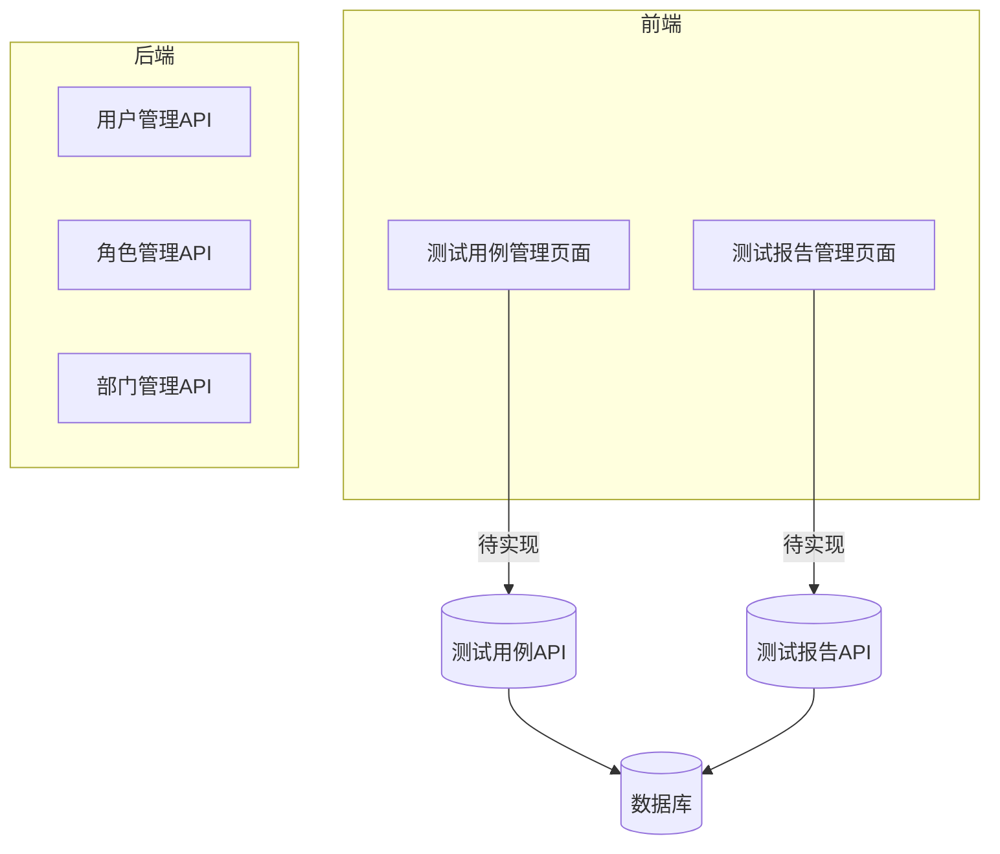
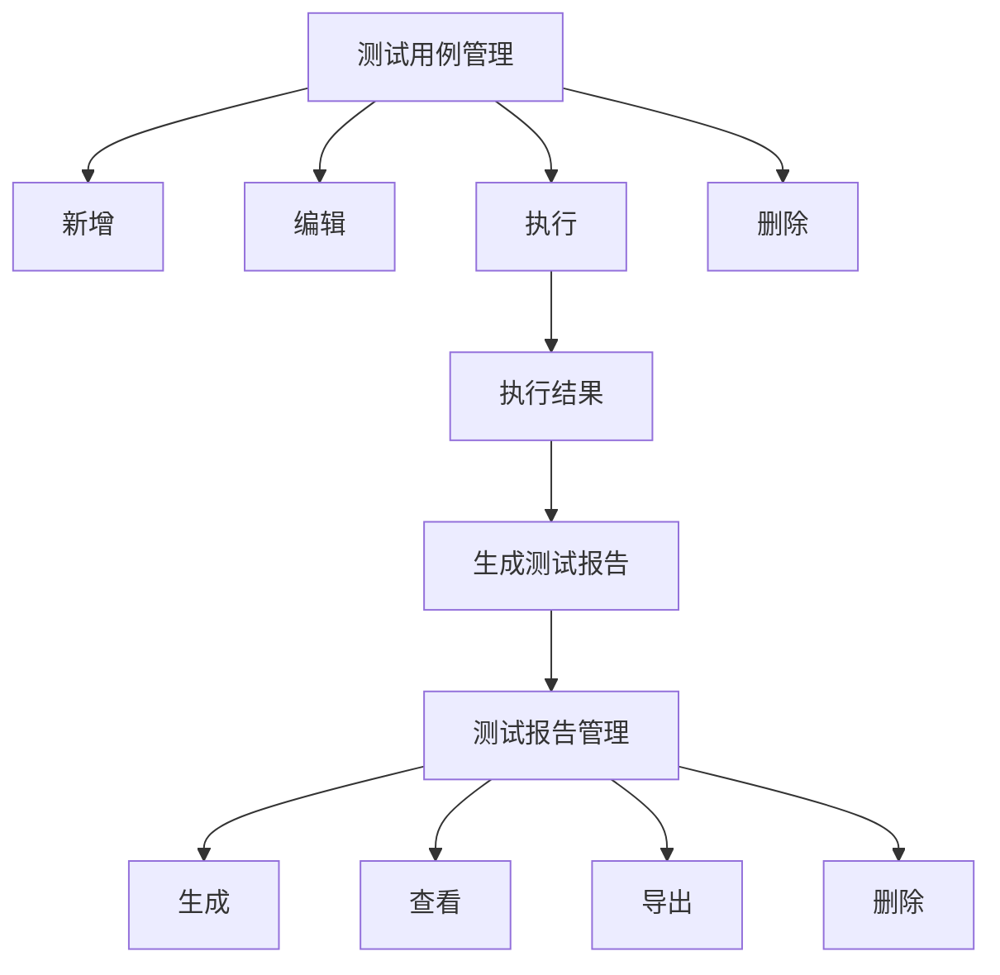
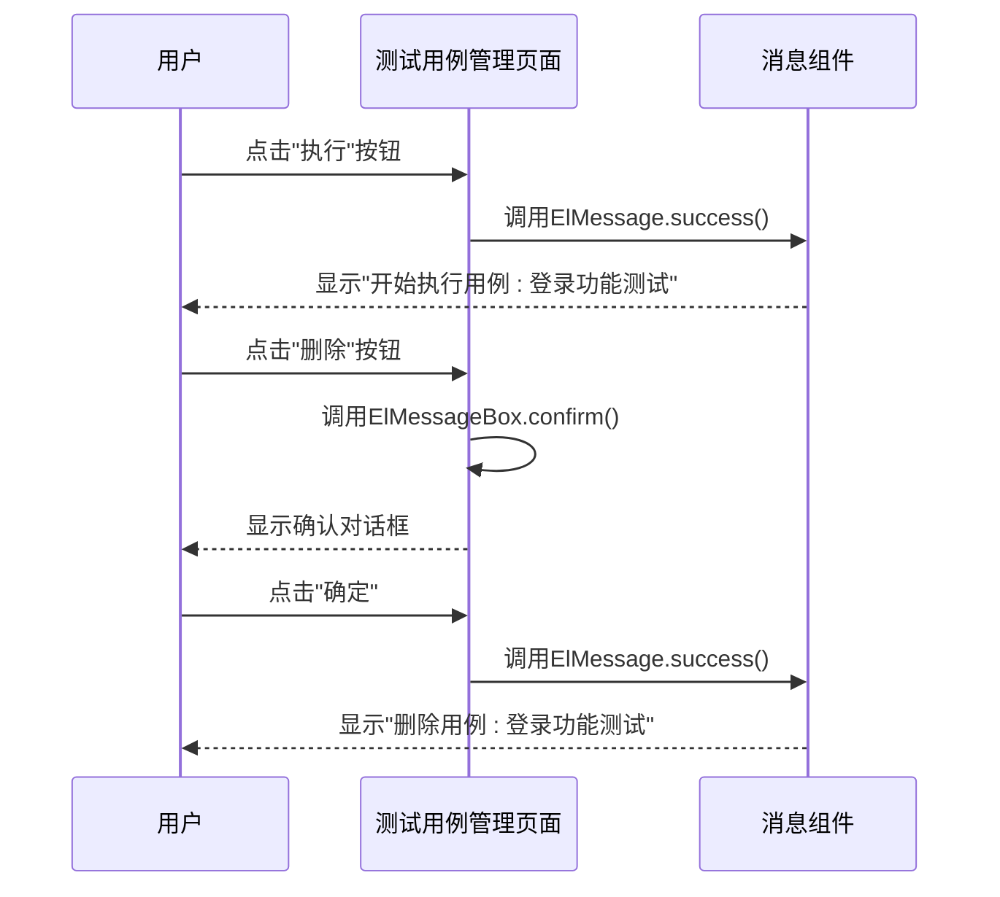
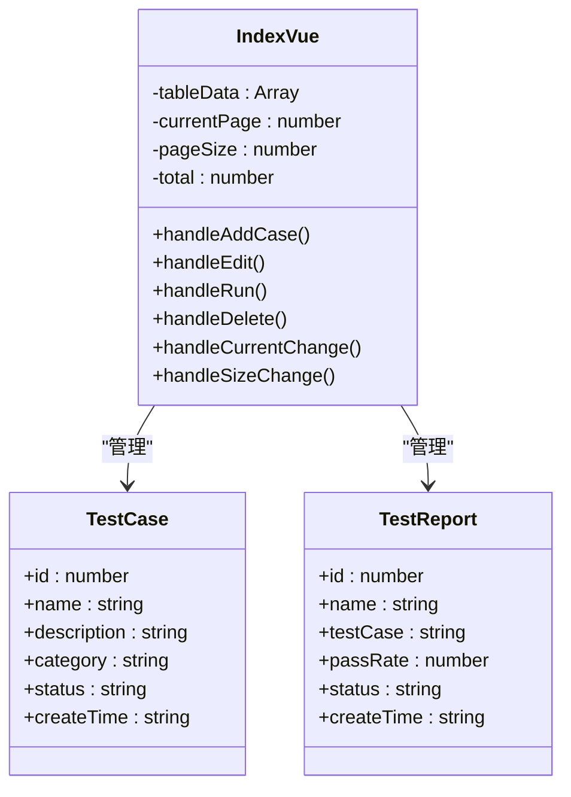
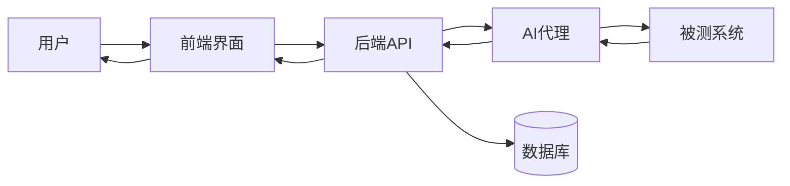

# 测试管理功能

<cite>
**本文档引用文件**  
- [Index.vue](file://AI-agent-frontend/src/views/test/cases/Index.vue)
- [Index.vue](file://AI-agent-frontend/src/views/test/reports/Index.vue)
- [index.ts](file://AI-agent-frontend/src/router/index.ts) - *路由配置已更新*
- [AppSidebar.vue](file://AI-agent-frontend/src/components/Layout/AppSidebar.vue) - *侧边栏菜单已更新*
- [AppBreadcrumb.vue](file://AI-agent-frontend/src/components/Layout/AppBreadcrumb.vue) - *面包屑导航已更新*
</cite>

## 更新摘要
**已做更改**  
- 更新了测试管理功能的前端路由与菜单配置说明
- 补充了测试用例与测试报告页面的导航路径信息
- 修正了现有文档中关于测试管理模块在系统中实际可见性的描述
- 增强了源码引用跟踪，新增了路由和布局组件的引用
- 保持原有功能分析内容不变，因后端代码变更不影响测试管理模块

## 目录
1. [简介](#简介)
2. [项目结构](#项目结构)
3. [核心功能分析](#核心功能分析)
4. [前端页面布局与交互逻辑](#前端页面布局与交互逻辑)
5. [测试用例与测试报告的关联机制](#测试用例与测试报告的关联机制)
6. [典型测试场景操作指引](#典型测试场景操作指引)

## 简介
本系统旨在提供完整的测试管理功能，涵盖测试用例的全生命周期管理（创建、编辑、删除、执行）以及测试报告的生成、查看与导出。系统采用前后端分离架构，前端基于Vue 3与Element Plus构建用户界面，后端提供API服务支持数据持久化与业务逻辑处理。尽管当前后端尚未实现相关API接口，但前端已具备完整的UI交互设计与模拟逻辑。

根据最新代码状态，测试管理模块包含“测试用例”和“测试报告”两个子页面，可通过左侧菜单栏的“测试管理”入口访问。该模块的路由配置、侧边栏导航及面包屑路径均已完整实现。

## 项目结构
项目由前后端两个主要模块构成：
- **AI-agent-backend**：基于Python的后端服务，采用FastAPI框架，包含用户、角色、部门等RBAC权限管理功能，但尚未实现测试管理相关模块。
- **AI-agent-frontend**：基于Vue 3的前端应用，已实现测试用例和测试报告的管理页面，位于`src/views/test/`目录下。

**图示来源**
- [Index.vue](file://AI-agent-frontend/src/views/test/cases/Index.vue)
- [Index.vue](file://AI-agent-frontend/src/views/test/reports/Index.vue)

## 核心功能分析
系统核心功能分为测试用例管理和测试报告管理两大模块，均已在前端实现UI层和交互逻辑，但后端服务尚未对接。

### 测试用例管理
支持测试用例的增删改查与执行操作，具体功能包括：
- **新增用例**：通过“新增用例”按钮触发创建流程
- **编辑用例**：修改现有测试用例的属性
- **执行用例**：启动测试用例的执行流程
- **删除用例**：移除不再需要的测试用例
- **状态展示**：通过标签颜色区分“通过”、“失败”、“待执行”状态

### 测试报告管理
支持测试报告的生成、查看、导出与删除，具体功能包括：
- **生成报告**：基于测试执行结果生成可视化报告
- **查看报告**：浏览详细测试结果
- **导出报告**：将报告保存为文件
- **删除报告**：清理历史报告数据
- **通过率可视化**：使用进度条展示测试通过率
- **状态管理**：标识“已完成”、“生成中”、“失败”等状态

**图示来源**
- [Index.vue](file://AI-agent-frontend/src/views/test/cases/Index.vue)
- [Index.vue](file://AI-agent-frontend/src/views/test/reports/Index.vue)

**中文来源**
- [Index.vue](file://AI-agent-frontend/src/views/test/cases/Index.vue)
- [Index.vue](file://AI-agent-frontend/src/views/test/reports/Index.vue)

## 前端页面布局与交互逻辑
### 测试用例管理页面
位于`src/views/test/cases/Index.vue`，采用卡片式布局，包含以下组件：
- **头部区域**：显示标题“测试用例管理”和“新增用例”操作按钮
- **表格区域**：展示测试用例列表，包含ID、名称、描述、分类、状态、创建时间等字段
- **操作列**：提供“编辑”、“执行”、“删除”三个操作按钮
- **分页组件**：支持页码切换和每页显示数量调整

**交互逻辑：**
- 点击“新增用例”：弹出提示“新增用例功能待实现”
- 点击“编辑”：弹出提示“编辑用例: [用例名称]”
- 点击“执行”：弹出成功提示“开始执行用例: [用例名称]”
- 点击“删除”：弹出确认对话框，确认后提示“删除用例: [用例名称]”

**页面来源**
- [Index.vue](file://AI-agent-frontend/src/views/test/cases/Index.vue)

### 测试报告管理页面
位于`src/views/test/reports/Index.vue`，布局与用例管理页面类似，但包含报告特有的字段：
- **通过率展示**：使用`el-progress`组件以进度条形式展示通过率
- **状态类型**：区分“已完成”、“生成中”、“失败”三种状态
- **操作功能**：提供“查看”、“导出”、“删除”操作

**交互逻辑：**
- 点击“生成报告”：弹出提示“生成报告功能待实现”
- 点击“查看”：弹出提示“查看报告: [报告名称]”
- 点击“导出”：弹出成功提示“导出报告: [报告名称]”
- 点击“删除”：弹出确认对话框，确认后提示“删除报告: [报告名称]”

**页面来源**
- [Index.vue](file://AI-agent-frontend/src/views/test/reports/Index.vue)

### 导航与路由配置
测试管理模块的导航路径已在前端系统中正确配置，用户可通过以下方式访问：
- **侧边栏菜单**：在左侧导航栏中点击“测试管理”展开，选择“测试用例”或“测试报告”
- **路由地址**：直接访问 `/test/cases` 或 `/test/reports`
- **面包屑导航**：页面顶部显示完整的导航路径，如“首页 / 测试管理 / 测试用例”

**导航来源**
- [index.ts](file://AI-agent-frontend/src/router/index.ts#L92-L143)
- [AppSidebar.vue](file://AI-agent-frontend/src/components/Layout/AppSidebar.vue#L55-L75)
- [AppBreadcrumb.vue](file://AI-agent-frontend/src/components/Layout/AppBreadcrumb.vue#L47-L49)

## 测试用例与测试报告的关联机制
### 数据关联模型
测试报告与测试用例通过名称字段建立关联关系：
- **测试用例**：包含`name`（用例名称）、`description`（描述）等属性
- **测试报告**：包含`testCase`（关联用例）字段，其值对应测试用例的名称

### 执行结果回传流程
尽管当前为模拟实现，但可预见的完整流程如下：
1. 用户点击“执行”按钮启动测试用例
2. 前端调用后端执行接口
3. AI代理执行测试任务并返回结果
4. 后端处理结果并持久化存储
5. 生成测试报告并更新状态为“已完成”
6. 前端刷新报告列表展示最新结果

**图示来源**
- [Index.vue](file://AI-agent-frontend/src/views/test/cases/Index.vue)
- [Index.vue](file://AI-agent-frontend/src/views/test/reports/Index.vue)

## 典型测试场景操作指引
### 场景一：创建并执行测试用例
1. 进入“测试用例管理”页面
2. 点击“新增用例”按钮
3. 在弹出的表单中填写用例信息（名称、描述、分类等）
4. 保存用例后，在列表中找到该用例
5. 点击“执行”按钮启动测试
6. 查看执行结果提示

### 场景二：查看测试报告
1. 进入“测试报告管理”页面
2. 在报告列表中找到目标报告
3. 点击“查看”按钮
4. 浏览报告详情，包括通过率、执行状态等信息

### 场景三：导出与删除报告
1. 在报告列表中选择需要操作的报告
2. 点击“导出”按钮将报告保存到本地
3. 如需删除，点击“删除”按钮
4. 在确认对话框中点击“确定”完成删除

### 注意事项
- 当前所有功能均为前端模拟实现，实际数据未持久化
- “生成报告”功能尚未实现，点击后仅显示提示信息
- 分页功能已实现但数据为静态模拟数据
- 系统需后端实现`/api/test-cases`和`/api/test-reports`等API接口才能完成完整功能

**中文来源**
- [Index.vue](file://AI-agent-frontend/src/views/test/cases/Index.vue)
- [Index.vue](file://AI-agent-frontend/src/views/test/reports/Index.vue)