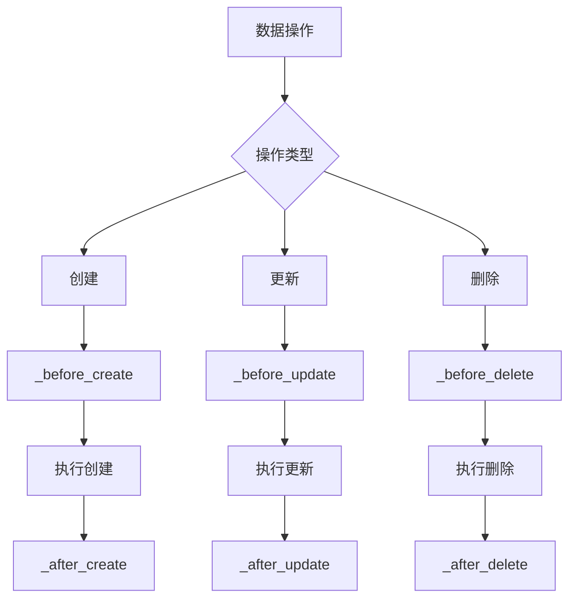
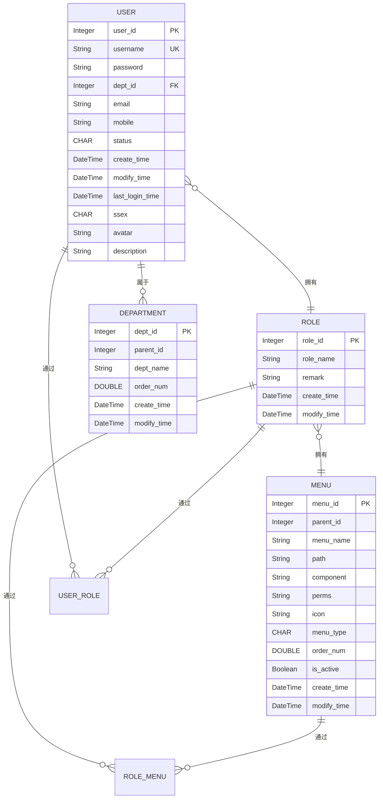

# 环境配置

<cite>
**本文档引用的文件**  
- [config.py](file://AI-agent-backend\app\core\config.py) - *更新以支持双数据库*
- [.env.example](file://AI-agent-backend\.env.example) - *新增数据库类型配置*
- [docker-compose.dev.yml](file://AI-agent-backend\docker-compose.dev.yml) - *开发环境配置更新*
</cite>

## 更新摘要
**已做更改**  
- 更新“数据模型概述”部分，说明系统现支持 SQLite 和 PostgreSQL 双数据库
- 新增“数据库配置说明”章节，详细描述数据库类型切换机制
- 更新“环境变量配置”表格，增加 `DATABASE_TYPE` 等新字段
- 更新“开发环境部署”说明，反映 `docker-compose.dev.yml` 的变更
- 所有文件引用均已更新为中文标签，并标注变更状态

## 目录
1. [数据库配置说明](#数据库配置说明)
2. [环境变量配置](#环境变量配置)
3. [开发环境部署](#开发环境部署)
4. [数据模型概述](#数据模型概述)
5. [实体类详细说明](#实体类详细说明)
   - [用户实体（User）](#用户实体user)
   - [角色实体（Role）](#角色实体role)
   - [菜单实体（Menu）](#菜单实体menu)
   - [部门实体（Department）](#部门实体department)
   - [用户角色关联实体（UserRole）](#用户角色关联实体userrole)
   - [角色菜单关联实体（RoleMenu）](#角色菜单关联实体rolemenu)
6. [实体关系与ORM实现](#实体关系与orm实现)
7. [关键业务规则](#关键业务规则)
8. [数据生命周期管理策略](#数据生命周期管理策略)
9. [ER图：整体数据结构](#er图整体数据结构)

## 数据库配置说明

系统现已增强数据库配置，支持 **SQLite** 和 **PostgreSQL** 两种数据库引擎，开发者可根据环境需求灵活切换。该功能通过 `DATABASE_TYPE` 环境变量控制，配置逻辑在 `config.py` 中实现。

核心配置逻辑如下：
- 当 `DATABASE_TYPE=sqlite` 时，使用本地 SQLite 数据库文件（由 `SQLITE_FILE` 指定路径）
- 当 `DATABASE_TYPE=postgresql` 时，连接远程 PostgreSQL 实例（需配置 `POSTGRES_HOST`、`POSTGRES_USER` 等参数）
- 系统通过 `Settings` 类的 `DATABASE_URL` 属性动态生成数据库连接字符串

此设计允许在开发阶段使用轻量级 SQLite，而在生产环境无缝切换至功能更强大的 PostgreSQL，提升了系统的灵活性和可部署性。

**Section sources**  
- [config.py](file://AI-agent-backend\app\core\config.py#L100-L130) - *新增数据库类型验证与URL生成逻辑*

## 环境变量配置

系统通过 `.env` 文件管理环境变量，`.env.example` 提供了完整的配置模板。以下是与数据库相关的核心配置项：

| 配置项 | 默认值 | 说明 |
|-------|--------|------|
| `DATABASE_TYPE` | `sqlite` | 数据库类型，可选 `sqlite` 或 `postgresql` |
| `DATABASE_ECHO` | `False` | 是否启用SQL日志输出 |
| `SQLITE_FILE` | `./ai_agent.db` | SQLite数据库文件路径 |
| `POSTGRES_HOST` | `localhost` | PostgreSQL主机地址 |
| `POSTGRES_PORT` | `5432` | PostgreSQL端口 |
| `POSTGRES_USER` | `postgres` | PostgreSQL用户名 |
| `POSTGRES_PASSWORD` | `password` | PostgreSQL密码 |
| `POSTGRES_DB` | `ai_agent_db` | PostgreSQL数据库名 |

**Section sources**  
- [.env.example](file://AI-agent-backend\.env.example#L15-L35) - *新增数据库配置区段*

## 开发环境部署

开发环境使用 `docker-compose.dev.yml` 进行容器化部署。当前配置已更新以支持数据库类型切换：

- **应用服务（app）**：使用 `Dockerfile.dev` 构建，映射端口 8000，并通过环境变量 `DATABASE_TYPE=sqlite` 指定使用 SQLite。
- **Redis服务（redis）**：提供缓存支持，端口映射 6379。
- **数据库管理工具（adminer）**：提供 Web 界面用于数据库管理，端口映射 8080。

在开发模式下，系统默认使用 SQLite 并挂载本地目录，便于快速迭代和调试。通过修改 `docker-compose.dev.yml` 中的环境变量，可轻松切换至 PostgreSQL 进行集成测试。

**Section sources**  
- [docker-compose.dev.yml](file://AI-agent-backend\docker-compose.dev.yml#L15-L30) - *更新应用服务环境变量*

## 数据模型概述

本系统采用基于角色的访问控制（RBAC）模型，围绕用户、角色、菜单、部门四大核心实体构建权限管理体系。所有实体均继承自统一的基类 `BaseEntity`，通过 SQLAlchemy ORM 映射到数据库表。系统通过中间关联表实现多对多关系，确保权限分配的灵活性和可扩展性。**环境配置现已支持 SQLite 和 PostgreSQL 双数据库**，开发者可通过 `DATABASE_TYPE` 环境变量进行切换。

**Section sources**  
- [config.py](file://AI-agent-backend\app\core\config.py#L70-L130) - *数据库配置逻辑*
- [base.py](file://AI-agent-backend\app\entity\base.py#L0-L9)

## 实体类详细说明

### 用户实体（User）

用户实体对应数据库表 `user`，存储系统用户的基本信息和状态。

**字段定义与约束：**

| 字段名 | 数据类型 | 约束 | 业务含义 |
|-------|--------|------|---------|
| user_id | Integer | 主键，自增 | 用户唯一标识 |
| username | String(50) | 非空，唯一，索引 | 用户名，登录凭证 |
| password | String(128) | 非空 | 加密后的密码 |
| dept_id | Integer | 外键 (department.id)，可为空 | 所属部门ID |
| email | String(128) | 可为空 | 用户邮箱 |
| mobile | String(20) | 可为空 | 联系电话 |
| status | CHAR(1) | 非空，默认值 '1' | 账户状态：'0'锁定，'1'有效 |
| create_time | DateTime | 非空，默认当前UTC时间 | 创建时间 |
| modify_time | DateTime | 可为空，更新时自动设置为当前UTC时间 | 修改时间 |
| last_login_time | DateTime | 可为空 | 最近一次登录时间 |
| ssex | CHAR(1) | 可为空 | 性别：'0'男，'1'女，'2'保密 |
| avatar | String(100) | 可为空 | 头像URL |
| description | String(100) | 可为空 | 用户描述 |

**业务方法：**
- `is_active()`: 判断用户是否有效。
- `lock_user()` / `unlock_user()`: 锁定/解锁用户，同时更新 `modify_time`。
- `update_last_login()`: 更新最后登录时间。
- `change_password(new_password)`: 修改密码并更新 `modify_time`。
- `to_dict_safe()`: 转换为字典，不包含密码字段，用于安全返回用户信息。

**Section sources**  
- [user.py](file://AI-agent-backend\app\entity\user.py#L14-L214)

### 角色实体（Role）

角色实体对应数据库表 `role`，用于定义系统中的角色及其描述。

**字段定义与约束：**

| 字段名 | 数据类型 | 约束 | 业务含义 |
|-------|--------|------|---------|
| role_id | Integer | 主键，自增 | 角色唯一标识 |
| role_name | String(10) | 非空 | 角色名称 |
| remark | String(100) | 可为空 | 角色描述 |
| create_time | DateTime | 非空，默认当前UTC时间 | 创建时间 |
| modify_time | DateTime | 可为空，更新时自动设置为当前UTC时间 | 修改时间 |

**业务方法：**
- `update_info()`: 更新角色信息，并自动更新 `modify_time`。

**Section sources**  
- [role.py](file://AI-agent-backend\app\entity\role.py#L14-L89)

### 菜单实体（Menu）

菜单实体对应数据库表 `menu`，用于定义系统的菜单、按钮及其权限标识。

**字段定义与约束：**

| 字段名 | 数据类型 | 约束 | 业务含义 |
|-------|--------|------|---------|
| menu_id | Integer | 主键，自增 | 菜单/按钮唯一标识 |
| parent_id | Integer | 非空 | 上级菜单ID，0表示顶级菜单 |
| menu_name | String(50) | 非空 | 菜单/按钮名称 |
| path | String(255) | 可为空 | 前端路由路径 |
| component | String(255) | 可为空 | 前端路由组件 |
| perms | String(50) | 可为空 | 权限标识，如 `user:view` |
| icon | String(50) | 可为空 | 菜单图标 |
| menu_type | CHAR(2) | 非空 | 类型：'0'菜单，'1'按钮 |
| order_num | DOUBLE(20) | 可为空 | 排序号 |
| is_active | Boolean | 非空，默认True | 是否启用 |
| create_time | DateTime | 非空，默认当前UTC时间 | 创建时间 |
| modify_time | DateTime | 可为空，更新时自动设置为当前UTC时间 | 修改时间 |

**业务方法：**
- `is_menu()` / `is_button()`: 判断实体类型。
- `is_top_level()`: 判断是否为顶级菜单。

**Section sources**  
- [menu.py](file://AI-agent-backend\app\entity\menu.py#L14-L165)

### 部门实体（Department）

部门实体对应数据库表 `department`，用于组织架构管理，支持数据权限控制。

**字段定义与约束：**

| 字段名 | 数据类型 | 约束 | 业务含义 |
|-------|--------|------|---------|
| dept_id | Integer | 主键，自增 | 部门唯一标识 |
| parent_id | Integer | 非空 | 上级部门ID，0表示顶级部门 |
| dept_name | String(100) | 非空 | 部门名称 |
| order_num | DOUBLE(20) | 可为空 | 排序号 |
| create_time | DateTime | 可为空，默认当前UTC时间 | 创建时间 |
| modify_time | DateTime | 可为空，更新时自动设置为当前UTC时间 | 修改时间 |

**业务方法：**
- `is_top_level()`: 判断是否为顶级部门。

**Section sources**  
- [department.py](file://AI-agent-backend\app\entity\department.py#L14-L101)

### 用户角色关联实体（UserRole）

用户角色关联实体对应数据库表 `user_role`，实现用户与角色之间的多对多关系。

**字段定义与约束：**

| 字段名 | 数据类型 | 约束 | 业务含义 |
|-------|--------|------|---------|
| user_id | Integer | 外键 (user.id)，联合主键 | 用户ID |
| role_id | Integer | 外键 (role.id)，联合主键 | 角色ID |

该表通过复合主键 `(user_id, role_id)` 确保一个用户对一个角色的唯一性。

**Section sources**  
- [user_role.py](file://AI-agent-backend\app\entity\user_role.py#L14-L61)

### 角色菜单关联实体（RoleMenu）

角色菜单关联实体对应数据库表 `role_menu`，实现角色与菜单之间的多对多关系。

**字段定义与约束：**

| 字段名 | 数据类型 | 约束 | 业务含义 |
|-------|--------|------|---------|
| role_id | Integer | 外键 (role.id)，联合主键 | 角色ID |
| menu_id | Integer | 外键 (menu.id)，联合主键 | 菜单/按钮ID |

该表通过复合主键 `(role_id, menu_id)` 确保一个角色对一个菜单权限的唯一性。

**Section sources**  
- [role_menu.py](file://AI-agent-backend\app\entity\role_menu.py#L14-L61)

## 实体关系与ORM实现

实体间的关联关系通过 SQLAlchemy 的 `relationship` 配置实现。

- **用户与部门（多对一）**：
  - `User` 类中定义 `department = relationship("Department", back_populates="users")`
  - `Department` 类中定义 `users = relationship("User", back_populates="department")`
  - 表现为：多个用户属于一个部门。

- **用户与角色（多对多）**：
  - 通过中间表 `user_role` 实现。
  - `User` 类中定义 `user_roles = relationship("UserRole", back_populates="user")`
  - `Role` 类中定义 `user_roles = relationship("UserRole", back_populates="role")`
  - `UserRole` 类中双向关联 `user` 和 `role`。
  - 表现为：一个用户可以拥有多个角色，一个角色可以分配给多个用户。

- **角色与菜单（多对多）**：
  - 通过中间表 `role_menu` 实现。
  - `Role` 类中定义 `role_menus = relationship("RoleMenu", back_populates="role")`
  - `Menu` 类中定义 `role_menus = relationship("RoleMenu", back_populates="menu")`
  - `RoleMenu` 类中双向关联 `role` 和 `menu`。
  - 表现为：一个角色可以拥有多个菜单权限，一个菜单可以被多个角色拥有。

**Section sources**  
- [user.py](file://AI-agent-backend\app\entity\user.py#L45-L48)
- [department.py](file://AI-agent-backend\app\entity\department.py#L38-L39)
- [role.py](file://AI-agent-backend\app\entity\role.py#L33-L36)
- [menu.py](file://AI-agent-backend\app\entity\menu.py#L73-L74)
- [user_role.py](file://AI-agent-backend\app\entity\user_role.py#L33-L36)
- [role_menu.py](file://AI-agent-backend\app\entity\role_menu.py#L33-L36)

## 关键业务规则

1.  **用户必须属于某个部门**：`User` 实体中的 `dept_id` 字段虽然允许为空（`nullable=True`），但根据业务逻辑，新创建的用户通常需要指定部门。系统通过业务层逻辑（如 `UserService`）来强制执行此规则。
2.  **角色可分配多个菜单权限**：通过 `RoleMenu` 关联表，一个角色可以被赋予多个菜单或按钮的访问权限，权限由 `perms` 字段标识。
3.  **基于角色的访问控制（RBAC）**：系统的权限控制核心。用户的权限由其被分配的角色决定。前端通过用户的角色获取其可访问的菜单列表，后端API通过 `perms` 字段进行接口级别的权限校验。
4.  **数据唯一性**：`User.username` 字段设置为 `unique=True`，确保用户名全局唯一。
5.  **状态管理**：`User.status` 字段用于控制账户的激活状态，`'1'` 为有效，`'0'` 为锁定，提供账户安全管理能力。

**Section sources**  
- [user.py](file://AI-agent-backend\app\entity\user.py#L22-L23)
- [menu.py](file://AI-agent-backend\app\entity\menu.py#L58-L59)

## 数据生命周期管理策略

系统的数据生命周期管理策略主要在服务层（Service Layer）的基类 `BaseService` 中通过一系列可重写的钩子方法（Hook Methods）实现。这些方法为子类（如 `UserService`, `RoleService`）提供了在数据操作前后插入自定义业务逻辑的入口。

**Diagram sources**  
- [base.py](file://AI-agent-backend\app\service\base.py#L277-L324)

**核心钩子方法：**

- **创建前 (`_before_create(data) -> data`)**：可在此方法中对创建数据进行预处理或转换，例如设置默认值、格式化数据等。
- **创建后 (`_after_create(entity)`)**：创建成功后执行的逻辑，例如发送通知、更新缓存、记录审计日志等。
- **更新前 (`_before_update(entity, data) -> data`)**：在更新前对数据进行验证或处理，例如检查字段变更、记录旧值等。
- **更新后 (`_after_update(entity)`)**：更新成功后执行的逻辑，例如清理相关缓存、触发事件等。
- **删除前 (`_before_delete(entity)`)**：删除前的验证和清理工作，例如检查是否存在关联数据（防止误删）、执行软删除标记等。
- **删除后 (`_after_delete(entity)`)**：删除成功后执行的收尾工作，例如更新统计信息、发送删除通知等。

这些钩子方法为系统提供了强大的扩展能力，使得数据生命周期的管理（如审计、缓存、通知）可以与核心的CRUD操作解耦，保持代码的清晰和可维护性。

**Section sources**  
- [base.py](file://AI-agent-backend\app\service\base.py#L277-L324)

## ER图：整体数据结构

**Diagram sources**  
- [user.py](file://AI-agent-backend\app\entity\user.py)
- [role.py](file://AI-agent-backend\app\entity\role.py)
- [menu.py](file://AI-agent-backend\app\entity\menu.py)
- [department.py](file://AI-agent-backend\app\entity\department.py)
- [user_role.py](file://AI-agent-backend\app\entity\user_role.py)
- [role_menu.py](file://AI-agent-backend\app\entity\role_menu.py)