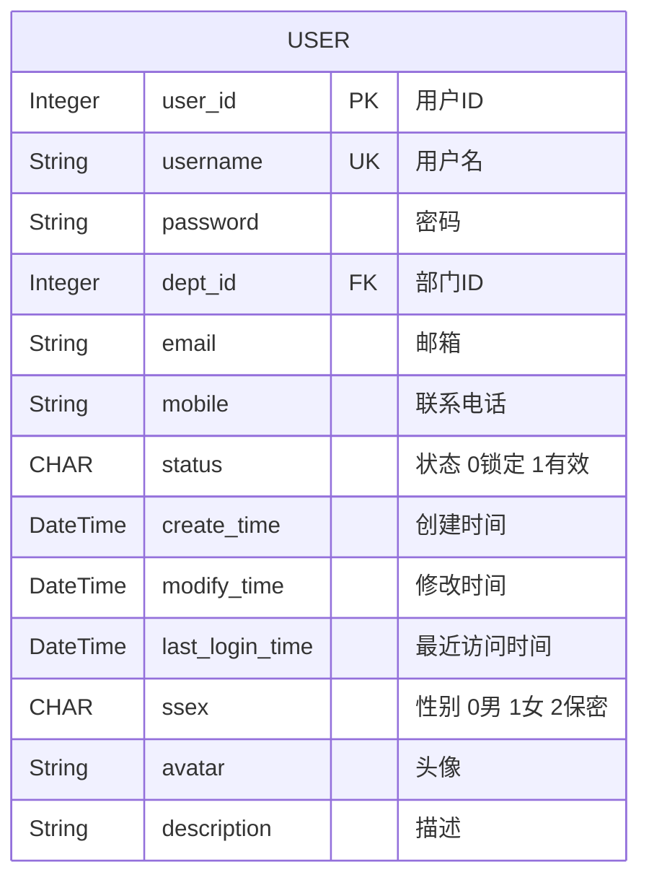
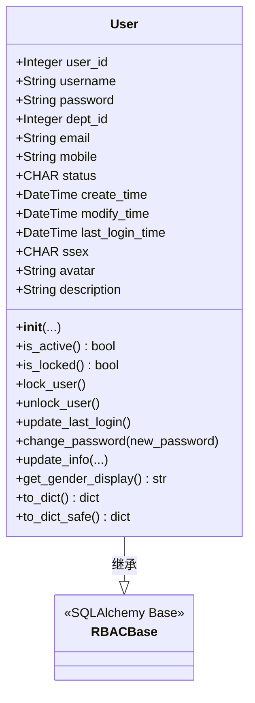
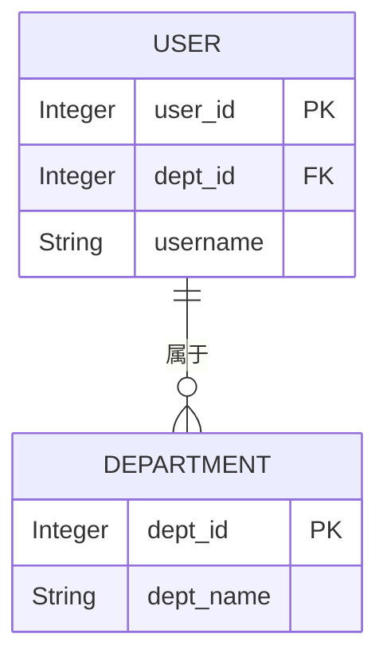
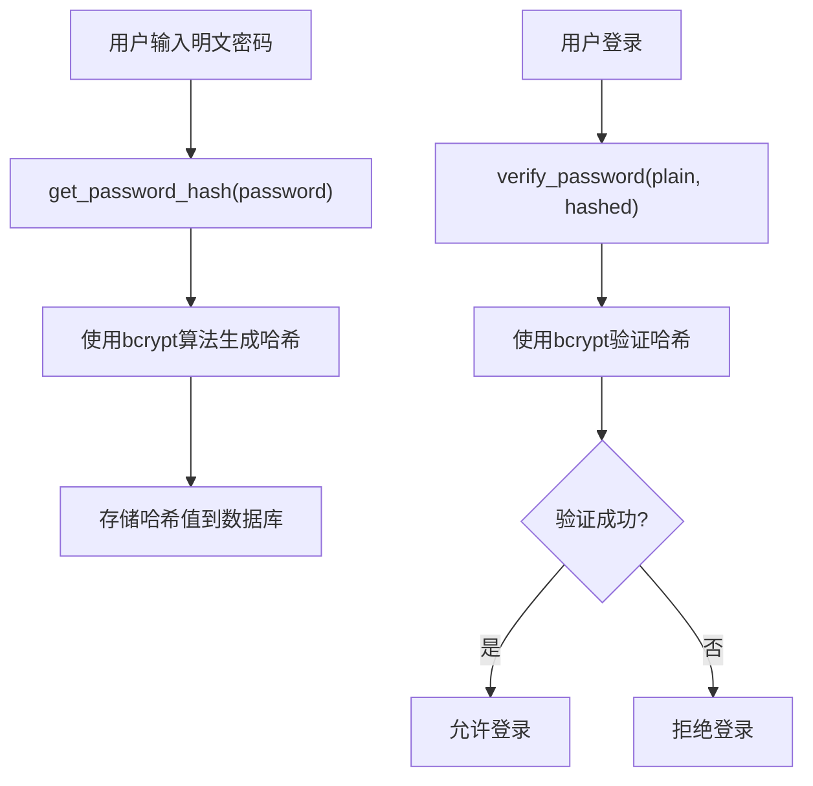
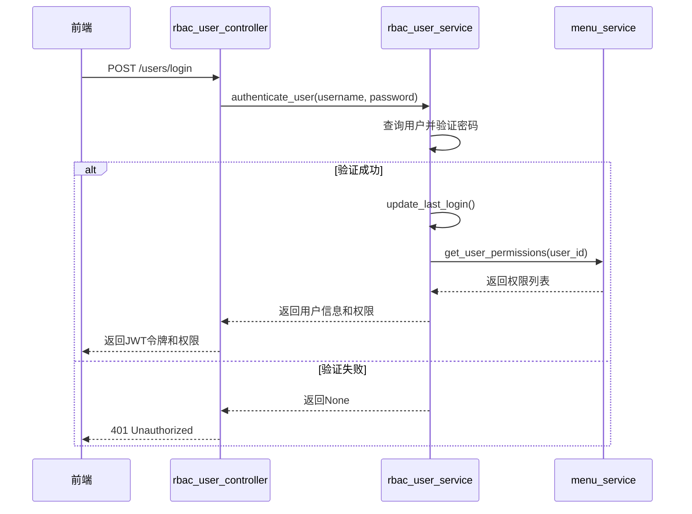

# 用户实体 (User)

<cite>
**本文档引用的文件**
- [user.py](file://AI-agent-backend\app\entity\user.py)
- [rbac_base.py](file://AI-agent-backend\app\entity\rbac_base.py)
- [base.py](file://AI-agent-backend\app\entity\base.py)
- [security.py](file://AI-agent-backend\app\core\security.py)
- [user_role.py](file://AI-agent-backend\app\entity\user_role.py)
- [department.py](file://AI-agent-backend\app\entity\department.py)
- [rbac_user_controller.py](file://AI-agent-backend\app\controller\rbac_user_controller.py)
- [rbac_user_service.py](file://AI-agent-backend\app\service\rbac_user_service.py)
</cite>

## 目录
1. [用户实体概述](#用户实体概述)
2. [字段定义与约束](#字段定义与约束)
3. [继承关系与基类特性](#继承关系与基类特性)
4. [外键关联与ORM关系](#外键关联与orm关系)
5. [密码加密存储机制](#密码加密存储机制)
6. [用户状态与业务方法](#用户状态与业务方法)
7. [RBAC权限系统中的角色](#rbac权限系统中的角色)
8. [常见查询模式与性能优化](#常见查询模式与性能优化)

## 用户实体概述

用户实体（User）是系统中核心的身份管理对象，对应数据库中的 `users` 表。该实体定义了用户的基本信息、状态管理、权限关联等关键属性，是实现用户认证、授权和管理功能的基础。用户实体通过多对多关系与角色实体关联，实现灵活的权限分配，并通过外键与部门实体建立归属关系，支持组织架构管理。

**用户实体的主要职责包括：**
- 存储用户身份信息（用户名、邮箱、手机号等）
- 管理用户状态（激活、锁定）
- 维护用户与部门的归属关系
- 通过关联表实现与角色的多对多权限绑定
- 提供安全的密码存储和用户信息序列化方法

**Section sources**
- [user.py](file://AI-agent-backend\app\entity\user.py#L1-L215)

## 字段定义与约束

用户实体的字段定义严格遵循数据库表结构设计，每个字段都明确了数据类型、约束条件和业务含义。



**Diagram sources**
- [user.py](file://AI-agent-backend\app\entity\user.py#L1-L215)

**Section sources**
- [user.py](file://AI-agent-backend\app\entity\user.py#L1-L215)

### 字段详细说明

| 字段名 | 数据类型 | 约束条件 | 业务含义 |
| :--- | :--- | :--- | :--- |
| `user_id` | `Integer` | 主键，自增 | 用户的唯一标识符 |
| `username` | `String(50)` | 非空，唯一，索引 | 用户的登录名，必须全局唯一 |
| `password` | `String(128)` | 非空 | 加密存储的密码哈希值 |
| `dept_id` | `Integer` | 可为空，外键 | 关联的部门ID，表示用户所属部门 |
| `email` | `String(128)` | 可为空 | 用户的电子邮箱地址 |
| `mobile` | `String(20)` | 可为空 | 用户的联系电话 |
| `status` | `CHAR(1)` | 非空，默认值'1' | 用户状态，'1'表示有效，'0'表示锁定 |
| `create_time` | `DateTime` | 非空，默认当前时间 | 记录用户创建的时间戳 |
| `modify_time` | `DateTime` | 可为空，更新时自动设置 | 记录用户信息最后一次修改的时间戳 |
| `last_login_time` | `DateTime` | 可为空 | 记录用户最后一次成功登录的时间 |
| `ssex` | `CHAR(1)` | 可为空 | 用户性别，'0'男，'1'女，'2'保密 |
| `avatar` | `String(100)` | 可为空 | 用户头像的存储路径或URL |
| `description` | `String(100)` | 可为空 | 用户的个人描述或备注信息 |

## 继承关系与基类特性

用户实体通过继承机制复用基类提供的通用功能，其继承结构如下：
- `User` 继承自 `RBACBase`
- `RBACBase` 是一个通过 `declarative_base()` 创建的SQLAlchemy声明式基类



**Diagram sources**
- [user.py](file://AI-agent-backend\app\entity\user.py#L1-L215)
- [rbac_base.py](file://AI-agent-backend\app\entity\rbac_base.py#L1-L10)

**Section sources**
- [user.py](file://AI-agent-backend\app\entity\user.py#L1-L215)
- [rbac_base.py](file://AI-agent-backend\app\entity\rbac_base.py#L1-L10)

### 基类功能分析

虽然 `RBACBase` 本身不包含具体字段，但它作为所有RBAC相关实体的统一基类，确保了所有实体都遵循相同的声明式映射规则。值得注意的是，项目中还存在一个 `BaseEntity` 基类（位于 `app/entity/base.py`），它提供了更丰富的通用功能，如软删除、钩子方法和数据验证。然而，用户实体并未直接继承 `BaseEntity`，而是直接使用了 `RBACBase`，这表明其设计更侧重于基础的ORM映射，而将通用业务逻辑的实现交由服务层处理。

## 外键关联与ORM关系

用户实体通过ORM的 `relationship` 配置，定义了与其他实体的关联关系，主要体现在与部门和角色的关联上。

### 与部门的归属关系

用户实体通过 `dept_id` 字段与 `Department` 实体建立外键关联，表示一个用户属于一个部门。



**Diagram sources**
- [user.py](file://AI-agent-backend\app\entity\user.py#L1-L215)
- [department.py](file://AI-agent-backend\app\entity\department.py#L1-L102)

**Section sources**
- [user.py](file://AI-agent-backend\app\entity\user.py#L1-L215)
- [department.py](file://AI-agent-backend\app\entity\department.py#L1-L102)

在代码中的实现如下：
```python
# 在 user.py 中
dept_id = Column(Integer, ForeignKey('t_dept.dept_id'), nullable=True, comment="部门ID")
department = relationship("Department", back_populates="users")

# 在 department.py 中
users = relationship("User", back_populates="department")
```
此关系为一对多关系：一个部门可以有多个用户，但一个用户只能属于一个部门。

### 与角色的多对多关联

用户与角色之间是典型的多对多关系，通过一个中间关联表 `UserRole` 实现。

```mermaid
erDiagram
USER ||--o{ USER_ROLE }o--|| ROLE
USER {
Integer user_id PK
String username
}
USER_ROLE {
Integer user_id PK, FK
Integer role_id PK, FK
}
ROLE {
Integer role_id PK
String role_name
}
```

**Diagram sources**
- [user.py](file://AI-agent-backend\app\entity\user.py#L1-L215)
- [user_role.py](file://AI-agent-backend\app\entity\user_role.py#L1-L61)
- [role.py](file://AI-agent-backend\app\entity\role.py#L1-L41)

**Section sources**
- [user.py](file://AI-agent-backend\app\entity\user.py#L1-L215)
- [user_role.py](file://AI-agent-backend\app\entity\user_role.py#L1-L61)
- [role.py](file://AI-agent-backend\app\entity\role.py#L1-L41)

在代码中的实现如下：
```python
# 在 user.py 中
user_roles = relationship("UserRole", back_populates="user")

# 在 user_role.py 中
user = relationship("User", back_populates="user_roles")
role = relationship("Role", back_populates="user_roles")
user_id = Column(Integer, ForeignKey('users.user_id'), primary_key=True)
role_id = Column(Integer, ForeignKey('t_role.role_id'), primary_key=True)

# 在 role.py 中
user_roles = relationship("UserRole", back_populates="role")
```
`UserRole` 实体作为关联表，其主键由 `user_id` 和 `role_id` 共同组成，实现了用户与角色的双向关联。

## 密码加密存储机制

系统采用安全的密码哈希算法来存储用户密码，确保即使数据库泄露，原始密码也无法被轻易破解。

### 加密实现

密码加密功能由 `app/core/security.py` 模块提供，核心是使用 `passlib` 库的 `CryptContext`。



**Diagram sources**
- [security.py](file://AI-agent-backend\app\core\security.py#L1-L313)
- [user.py](file://AI-agent-backend\app\entity\user.py#L1-L215)
- [rbac_user_service.py](file://AI-agent-backend\app\service\rbac_user_service.py#L1-L347)

**Section sources**
- [security.py](file://AI-agent-backend\app\core\security.py#L1-L313)
- [rbac_user_service.py](file://AI-agent-backend\app\service\rbac_user_service.py#L1-L347)

关键代码如下：
```python
# 在 security.py 中
pwd_context = CryptContext(schemes=["bcrypt"], deprecated="auto")

def get_password_hash(password: str) -> str:
    return pwd_context.hash(password)

def verify_password(plain_password: str, hashed_password: str) -> bool:
    return pwd_context.verify(plain_password, hashed_password)

# 在 rbac_user_service.py 中创建用户时
hashed_password = get_password_hash(password)
user = User(username=username, password=hashed_password, ...)
```

当用户注册时，服务层调用 `get_password_hash` 将明文密码转换为不可逆的哈希值后存储。当用户登录时，系统会获取数据库中的哈希值，并使用 `verify_password` 函数与用户输入的明文密码进行比对。

## 用户状态与业务方法

用户实体不仅包含数据字段，还封装了与用户状态管理相关的业务逻辑方法。

### 用户状态字段

`status` 字段是用户状态的核心，其业务含义如下：
- **'1' (有效)**: 用户可以正常登录和使用系统。
- **'0' (锁定)**: 用户被锁定，无法登录，通常用于安全控制或管理员操作。

### 核心业务方法

| 方法名 | 参数 | 功能说明 |
| :--- | :--- | :--- |
| `is_active()` | 无 | 判断用户是否有效，返回 `True` 表示状态为'1' |
| `is_locked()` | 无 | 判断用户是否被锁定，返回 `True` 表示状态为'0' |
| `lock_user()` | 无 | 将用户状态设置为'0'（锁定），并更新修改时间 |
| `unlock_user()` | 无 | 将用户状态设置为'1'（解锁），并更新修改时间 |
| `update_last_login()` | 无 | 更新 `last_login_time` 字段为当前时间 |
| `change_password(new_password)` | `new_password`: 新的加密密码 | 更新密码字段和修改时间 |
| `update_info(...)` | 各种可选信息参数 | 安全地更新用户个人信息，并更新修改时间 |
| `get_gender_display()` | 无 | 根据 `ssex` 字段返回“男”、“女”或“保密”等可读文本 |
| `to_dict()` | 无 | 将用户对象转换为包含所有字段的字典 |
| `to_dict_safe()` | 无 | 将用户对象转换为字典，但不包含密码字段，用于安全的数据传输 |

这些方法将数据操作与业务逻辑紧密结合，提高了代码的可维护性和安全性。

**Section sources**
- [user.py](file://AI-agent-backend\app\entity\user.py#L1-L215)

## RBAC权限系统中的角色

用户实体是RBAC（基于角色的访问控制）权限系统的核心组成部分。

### 在RBAC中的作用

1.  **主体 (Subject)**: 用户是系统操作的主体，所有权限检查都围绕用户进行。
2.  **权限载体**: 用户通过被分配一个或多个角色，从而获得角色所拥有的权限。
3.  **状态控制**: 用户的 `status` 状态直接影响其访问权限，锁定的用户无法进行任何操作。

### 权限获取流程

当用户登录成功后，系统会通过以下流程获取其权限：
1.  调用 `RBACUserService.get_user_roles(user_id)` 获取用户的所有角色。
2.  调用 `MenuService.get_user_permissions(user_id)` 获取用户通过角色继承的所有菜单权限标识。
3.  将权限标识列表返回给前端，用于控制UI元素的显示和API接口的访问。



**Diagram sources**
- [rbac_user_controller.py](file://AI-agent-backend\app\controller\rbac_user_controller.py#L1-L530)
- [rbac_user_service.py](file://AI-agent-backend\app\service\rbac_user_service.py#L1-L347)
- [user.py](file://AI-agent-backend\app\entity\user.py#L1-L215)

**Section sources**
- [rbac_user_controller.py](file://AI-agent-backend\app\controller\rbac_user_controller.py#L1-L530)
- [rbac_user_service.py](file://AI-agent-backend\app\service\rbac_user_service.py#L1-L347)

## 常见查询模式与性能优化

用户实体在系统中的查询模式多样，主要通过服务层和控制器暴露API。

### 常见查询模式

1.  **根据ID查询**: `get_user_by_id(user_id)`，用于获取用户详情页面。
2.  **根据用户名查询**: `get_user_by_username(username)`，用于登录认证。
3.  **获取所有用户**: `get_all_users()`，用于用户管理列表。
4.  **搜索用户**: `search_users(keyword)`，支持按用户名等字段进行模糊搜索。
5.  **获取用户角色**: `get_user_roles(user_id)`，用于角色分配管理。
6.  **获取用户权限**: `get_user_permissions(user_id)`，用于动态生成菜单和权限校验。

### 性能优化建议

1.  **索引优化**: 确保 `username` 字段有唯一索引，`dept_id` 字段有普通索引，以加速查询和外键关联。
2.  **关联查询优化**: 在需要同时获取用户及其角色信息的场景，考虑使用 `JOIN` 查询或在服务层进行批量查询，避免N+1查询问题。例如，获取所有用户及其角色时，应先查询所有用户，再一次性查询所有关联的 `UserRole` 记录，然后在内存中进行关联。
3.  **缓存策略**: 对于不经常变动的数据，如用户的基本信息和权限列表，可以引入Redis等缓存机制。在用户登录后，将其权限列表缓存一段时间，减少数据库查询压力。
4.  **分页查询**: 对于 `get_all_users` 和 `search_users` 这类可能返回大量数据的接口，必须实现分页功能，避免一次性加载过多数据导致性能下降。
5.  **选择性字段加载**: 在某些场景下，如果只需要用户的部分信息（如仅用户名和ID），可以使用SQLAlchemy的 `load_only` 功能，只加载必要的字段，减少数据传输量。

**Section sources**
- [rbac_user_service.py](file://AI-agent-backend\app\service\rbac_user_service.py#L1-L347)
- [rbac_user_controller.py](file://AI-agent-backend\app\controller\rbac_user_controller.py#L1-L530)