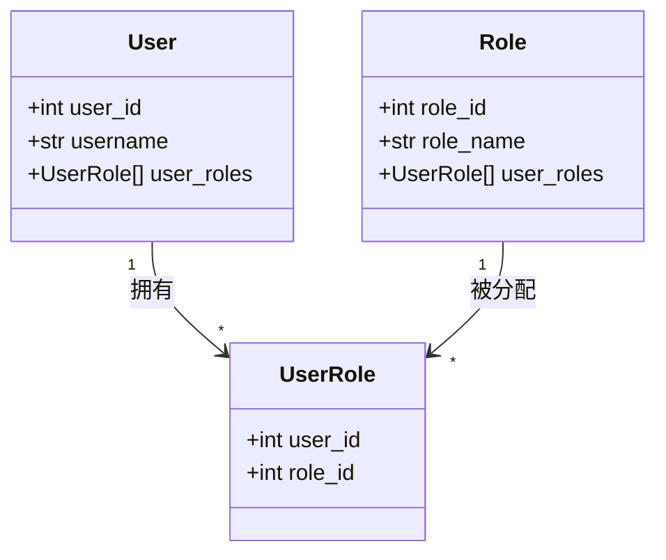
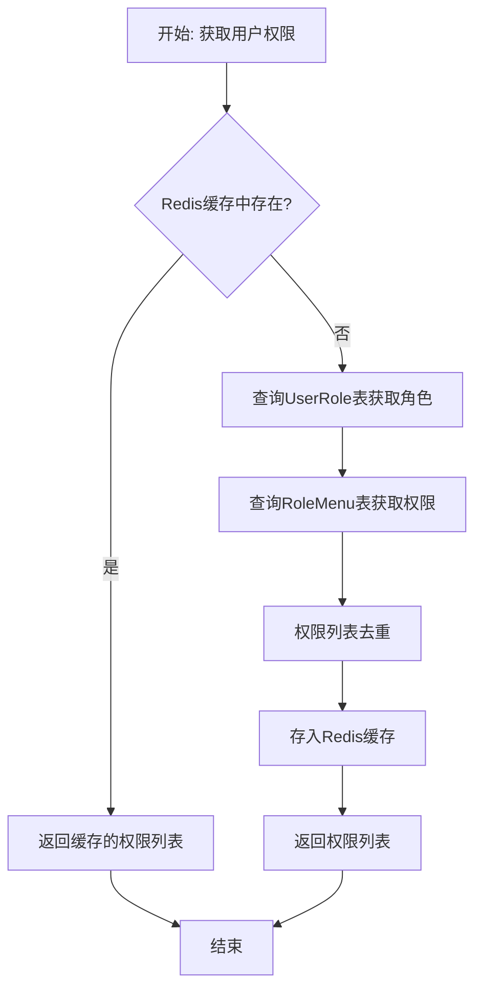
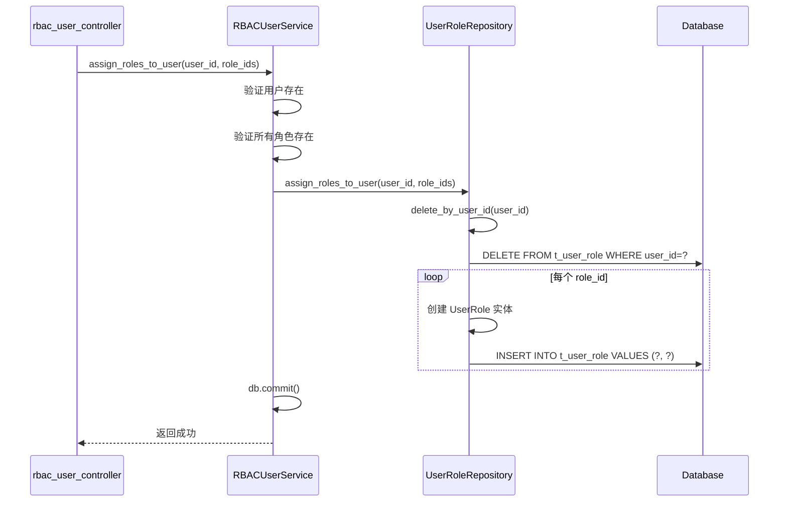

# 用户角色关联 (UserRole)

<cite>
**本文档中引用的文件**  
- [user_role.py](file://AI-agent-backend/app/entity/user_role.py)
- [user.py](file://AI-agent-backend/app/entity/user.py)
- [role.py](file://AI-agent-backend/app/entity/role.py)
- [user_role_repository.py](file://AI-agent-backend/app/repository/user_role_repository.py)
- [rbac_user_service.py](file://AI-agent-backend/app/service/rbac_user_service.py)
- [menu_service.py](file://AI-agent-backend/app/service/menu_service.py)
- [redis_client.py](file://AI-agent-backend/app/utils/redis_client.py)
</cite>

## 目录
1. [用户角色关联表结构与职责](#用户角色关联表结构与职责)
2. [外键约束与索引策略](#外键约束与索引策略)
3. [RBAC模型中的多对多分配机制](#rbac模型中的多对多分配机制)
4. [用户登录后角色查询流程](#用户登录后角色查询流程)
5. [Redis缓存提升鉴权性能](#redis缓存提升鉴权性能)
6. [用户多角色场景支持优势](#用户多角色场景支持优势)
7. [权限冲突与优先级处理考量](#权限冲突与优先级处理考量)
8. [角色分配、移除及批量操作实现机制](#角色分配移除及批量操作实现机制)

## 用户角色关联表结构与职责

用户角色关联表（UserRole）是实现基于角色的访问控制（RBAC）模型的核心中间表，用于解耦用户（User）和角色（Role）之间的多对多关系。该表通过存储用户ID和角色ID的组合，建立用户与角色之间的映射关系。

在系统中，`UserRole` 实体类定义于 `user_role.py` 文件中，对应数据库表 `t_user_role`。其主要职责包括：
- **关系维护**：记录每个用户被分配了哪些角色。
- **权限继承基础**：为后续的权限计算提供数据支撑，即通过用户→角色→权限的链路实现权限继承。
- **灵活授权**：支持动态地为用户添加或移除角色，从而快速调整其访问权限。

```python
class UserRole(RBACBase):
    __tablename__ = "t_user_role"
    user_id = Column(Integer, ForeignKey('users.user_id'), primary_key=True, comment="用户ID")
    role_id = Column(Integer, ForeignKey('t_role.role_id'), primary_key=True, comment="角色ID")
```

**中文标签结构**  
- **表名**: t_user_role  
- **字段1**: user_id - 用户ID  
- **字段2**: role_id - 角色ID  
- **主键**: (user_id, role_id) 联合主键  
- **外键**: 分别关联 users 表和 t_role 表  

**本节来源**  
- [user_role.py](file://AI-agent-backend/app/entity/user_role.py#L1-L60)

## 外键约束与索引策略

`UserRole` 表的设计严格遵循数据库规范化原则，采用外键约束确保数据完整性，并利用联合主键隐式创建索引以优化查询性能。

### 外键约束
- `user_id` 字段外键指向 `users` 表的 `user_id`，确保所分配的角色必须对应一个真实存在的用户。
- `role_id` 字段外键指向 `t_role` 表的 `role_id`，确保角色分配的目标角色是系统中已定义的角色。
- 这种双向外键约束防止了“孤儿记录”的产生，保障了数据的一致性和可靠性。

### 索引策略
- 由于 `user_id` 和 `role_id` 组成联合主键，数据库会自动在这两个字段上创建**复合索引**。
- 该复合索引极大地优化了以下两类高频查询：
  1. 根据 `user_id` 查询该用户的所有角色（登录鉴权时常用）。
  2. 根据 `role_id` 查询拥有该角色的所有用户（角色管理时常用）。
- 无需额外创建单列索引，避免了存储开销和写入性能损耗。

```mermaid
erDiagram
USER ||--o{ USER_ROLE : "拥有"
ROLE ||--o{ USER_ROLE : "被分配给"
USER {
int user_id PK
string username UK
string password
char status
}
ROLE {
int role_id PK
string role_name
string remark
}
USER_ROLE {
int user_id PK FK
int role_id PK FK
}
```

**图示来源**  
- [user_role.py](file://AI-agent-backend/app/entity/user_role.py#L1-L60)
- [user.py](file://AI-agent-backend/app/entity/user.py#L1-L215)
- [role.py](file://AI-agent-backend/app/entity/role.py#L1-L90)

## RBAC模型中的多对多分配机制

在RBAC权限模型中，`UserRole` 表是实现“用户”与“角色”之间多对多关系的关键枢纽。一个用户可以被赋予多个角色（如“管理员”、“编辑”、“审计员”），同时一个角色也可以被分配给多个用户。

### 核心作用
- **解耦用户与权限**：用户不直接拥有权限，而是通过角色间接获得。这使得权限管理更加模块化和可维护。
- **简化权限管理**：管理员只需管理角色的权限，然后将角色分配给用户，无需为每个用户单独配置权限。
- **支持细粒度控制**：不同的角色可以拥有不同的菜单访问权限和操作权限（通过 `RoleMenu` 表实现），从而实现精细化的访问控制。

### 实现方式
通过 `UserRole` 表的联合主键 `(user_id, role_id)` 唯一标识一个用户角色分配关系。任何重复的分配尝试都会因主键冲突而被数据库拒绝，保证了关系的唯一性。



**图示来源**  
- [user_role.py](file://AI-agent-backend/app/entity/user_role.py#L1-L60)
- [user.py](file://AI-agent-backend/app/entity/user.py#L1-L215)
- [role.py](file://AI-agent-backend/app/entity/role.py#L1-L90)

## 用户登录后角色查询流程

当用户成功登录后，系统需要立即获取其所有角色，以便后续进行权限校验和菜单渲染。这一过程主要由 `RBACUserService` 和 `UserRoleRepository` 协同完成。

### 查询流程
1. 用户认证通过后，调用 `RBACUserService.get_user_roles(user_id)` 方法。
2. 该服务方法进一步委托给 `UserRoleRepository.get_roles_by_user_id(user_id)`。
3. Repository 层执行一个 SQL JOIN 查询，连接 `t_role` 和 `t_user_role` 表，筛选出指定 `user_id` 对应的所有角色。
4. 查询结果以 `Role` 对象列表的形式返回给上层服务。

### 关键代码实现
```python
# user_role_repository.py
def get_roles_by_user_id(self, user_id: int) -> List[Role]:
    return self.db.query(Role).join(
        UserRole, Role.ROLE_ID == UserRole.ROLE_ID
    ).filter(UserRole.USER_ID == user_id).all()
```

此查询利用了 `t_user_role` 表上 `(user_id, role_id)` 的复合索引，能够高效地定位到目标记录，确保登录后角色加载的低延迟。

**本节来源**  
- [user_role_repository.py](file://AI-agent-backend/app/repository/user_role_repository.py#L45-L93)
- [rbac_user_service.py](file://AI-agent-backend/app/service/rbac_user_service.py#L283-L288)

## Redis缓存提升鉴权性能

为了进一步提升系统的响应速度，特别是高频的权限校验操作，系统引入了 Redis 缓存机制，避免了对数据库的重复查询。

### 缓存策略
- **缓存内容**：用户的权限标识列表（`perms` 字符串列表）。
- **缓存键**：`user_permissions_{user_id}`，以用户ID为唯一标识。
- **缓存时效**：设置为1小时（TTL=3600秒），平衡了数据新鲜度与性能。
- **缓存位置**：在 `MenuService.get_user_permissions` 方法中实现。

### 工作流程
1. 当需要获取用户权限时，首先检查 Redis 中是否存在 `user_permissions_{user_id}` 的缓存。
2. 如果存在（缓存命中），直接返回缓存的权限列表，整个过程无需访问数据库。
3. 如果不存在（缓存未命中），则执行完整的数据库查询流程：
   - 通过 `UserRole` 表获取用户的所有角色。
   - 通过 `RoleMenu` 表获取这些角色对应的所有权限标识。
   - 对权限列表进行去重。
   - 将结果存入 Redis 缓存，供后续请求使用。

### 性能优势
- **减少数据库压力**：将高频的权限查询从数据库转移到内存，显著降低了数据库的负载。
- **降低响应延迟**：内存读取速度远快于数据库查询，极大地提升了 API 的响应速度。
- **提高系统吞吐量**：支持更高的并发用户数。

```python
# menu_service.py
def get_user_permissions(self, user_id: int) -> List[str]:
    cache_key = f"user_permissions_{user_id}"
    cached_permissions = cache_client.get(cache_key)
    if cached_permissions is not None:
        return cached_permissions

    # ... 执行数据库查询 ...
    
    # 存入缓存
    cache_client.set(cache_key, unique_permissions, ttl=3600)
    return unique_permissions
```



**图示来源**  
- [menu_service.py](file://AI-agent-backend/app/service/menu_service.py#L270-L303)
- [redis_client.py](file://AI-agent-backend/app/utils/redis_client.py#L1-L20)

## 用户多角色场景支持优势

`UserRole` 表的设计天然支持用户拥有多个角色的复杂业务场景，这是其核心优势所在。

### 主要优势
1. **灵活性高**：可以轻松地为用户组合不同的角色，例如一个用户可以同时是“部门经理”和“项目负责人”，从而继承两者的权限。
2. **管理便捷**：角色的权限是预先定义好的，管理员只需进行“分配”和“回收”操作，无需理解底层权限细节。
3. **扩展性强**：当业务发展需要新增权限时，只需创建新角色并配置其权限，然后分配给需要的用户，不影响现有用户。
4. **审计清晰**：通过查询 `UserRole` 表，可以清晰地追溯每个用户的权限来源，便于安全审计和合规检查。

### 应用场景
- **临时权限**：为用户临时分配一个“审计员”角色，完成审计后移除。
- **跨部门协作**：允许用户同时属于多个部门的角色体系。
- **分级管理**：不同级别的管理员拥有不同组合的角色。

**本节来源**  
- [user_role.py](file://AI-agent-backend/app/entity/user_role.py#L1-L60)
- [rbac_user_service.py](file://AI-agent-backend/app/service/rbac_user_service.py#L246-L281)

## 权限冲突与优先级处理考量

虽然当前代码实现中未显式处理权限冲突，但在设计上存在潜在的考量空间。

### 潜在问题
当一个用户拥有多个角色，而这些角色的权限发生冲突时（例如，一个角色允许访问某菜单，另一个角色禁止访问），系统需要有明确的处理策略。

### 常见处理策略
1. **累加模式（当前实现）**：所有角色的权限取并集。只要有一个角色拥有某项权限，用户就具备该权限。这是一种“有权限即有权限”的宽松策略。
2. **最严格模式**：所有角色的权限取交集。只有当所有角色都拥有某项权限时，用户才具备该权限。
3. **基于优先级**：为角色设置优先级，高优先级角色的权限覆盖低优先级角色的权限。

### 当前系统状态
根据现有代码分析，系统采用的是**累加模式**。`get_user_permissions` 方法将所有角色的权限列表合并后去重，这意味着权限是叠加的，不存在“禁止”权限的抵消机制。

### 设计建议
若未来需要支持更复杂的权限逻辑，可在 `Role` 表中增加 `priority` 字段，或在 `UserRole` 表中增加 `status` 字段来标记角色的生效状态，从而实现更精细的权限控制。

**本节来源**  
- [menu_service.py](file://AI-agent-backend/app/service/menu_service.py#L270-L303)
- [rbac_user_service.py](file://AI-agent-backend/app/service/rbac_user_service.py#L295-L308)

## 角色分配、移除及批量操作实现机制

`UserRole` 表的相关操作通过 `UserRoleRepository` 和 `RBACUserService` 两层实现，确保了业务逻辑的清晰和数据的一致性。

### 核心方法分析

#### 1. 批量分配角色 (`assign_roles_to_user`)
- **路径**：`RBACUserService.assign_roles_to_user` → `UserRoleRepository.assign_roles_to_user`
- **机制**：
  - **先清后加**：首先调用 `delete_by_user_id` 删除用户现有的所有角色。
  - **批量添加**：遍历新的角色ID列表，为每个角色创建一条 `UserRole` 记录并添加到数据库会话。
- **事务性**：整个操作在 `RBACUserService` 的 try-except 块中执行，确保数据库操作的原子性。成功则提交，失败则回滚。
- **完整性检查**：Service 层在执行前会检查用户和所有角色的存在性。

```python
# rbac_user_service.py
def assign_roles_to_user(self, user_id: int, role_ids: List[int]) -> bool:
    try:
        # 检查用户和角色是否存在
        user = self.user_repository.get_by_id(user_id)
        for role_id in role_ids:
            role = self.role_repository.get_by_id(role_id)
        # 分配角色
        self.user_role_repository.assign_roles_to_user(user_id, role_ids)
        self.db.commit()
        return True
    except Exception as e:
        self.db.rollback()
        return False
```

#### 2. 添加单个角色 (`add_role_to_user`)
- **路径**：`UserRoleRepository.add_role_to_user`
- **机制**：
  - **存在性检查**：先调用 `exists(user_id, role_id)` 方法查询该关联是否已存在。
  - **条件添加**：仅当关联不存在时，才创建新的 `UserRole` 记录。
- **用途**：适用于增量添加角色的场景，避免重复分配。

#### 3. 移除角色
- **`delete_by_user_id`**：移除用户的所有角色，用于角色的完全重置。
- **`delete_by_role_id`**：移除角色的所有用户关联，用于删除角色前的清理。
- **`delete_specific`**：移除用户与特定角色的关联，用于精确的权限回收。



**图示来源**  
- [rbac_user_service.py](file://AI-agent-backend/app/service/rbac_user_service.py#L246-L281)
- [user_role_repository.py](file://AI-agent-backend/app/repository/user_role_repository.py#L126-L161)