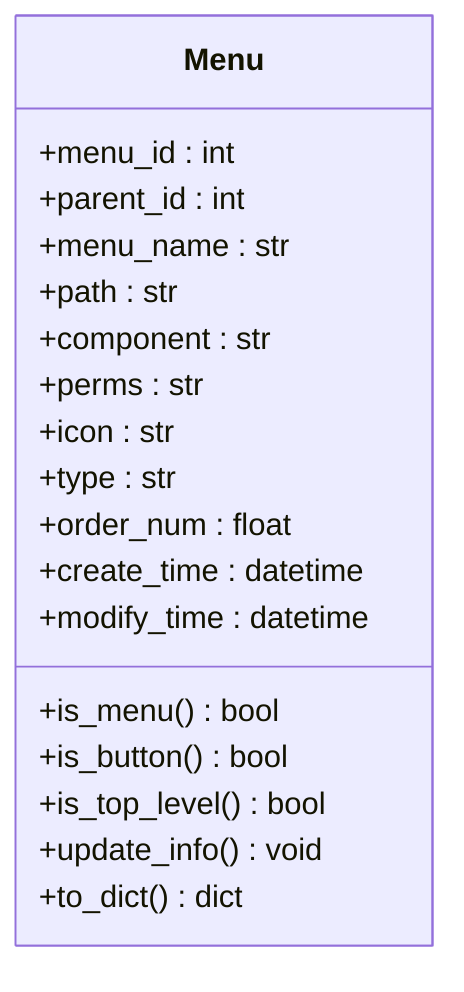
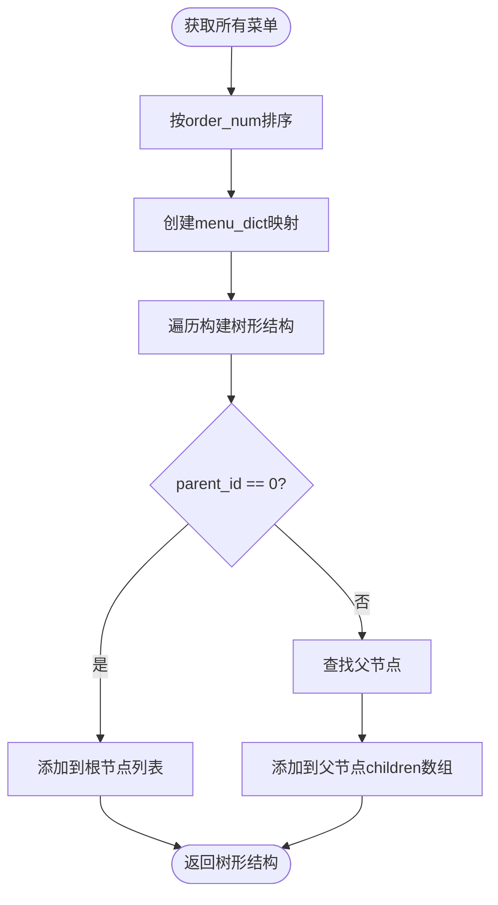
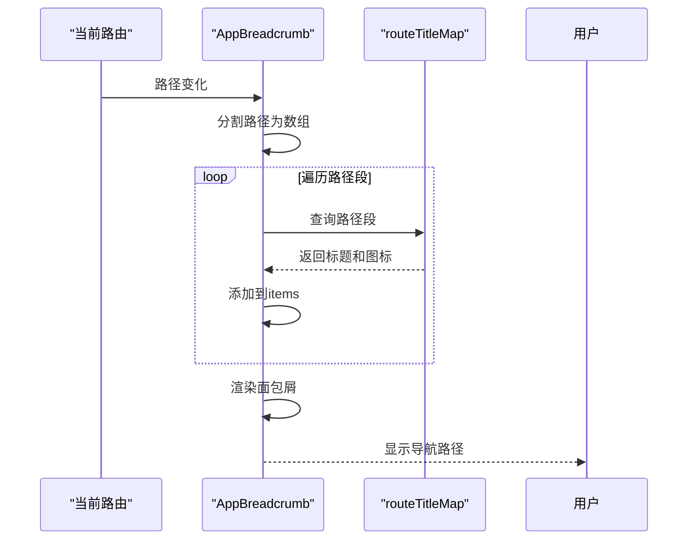
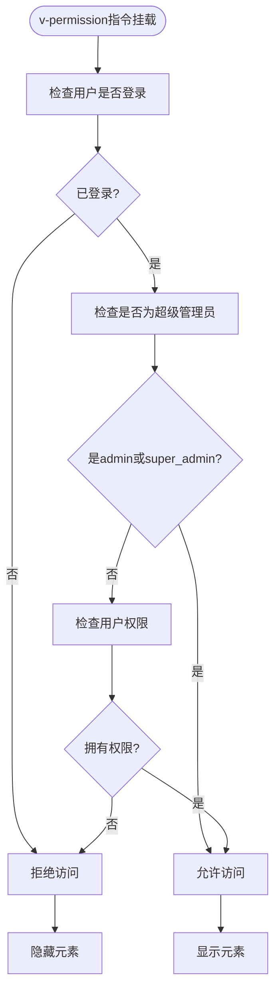
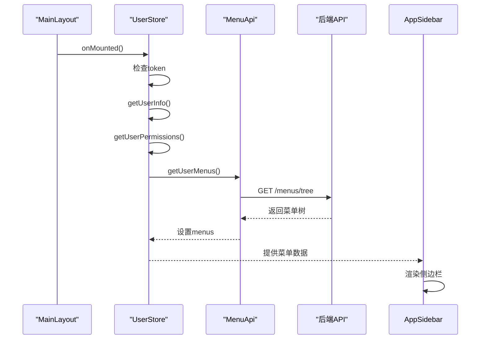

# 菜单实体 (Menu)

<cite>
**本文档中引用的文件**   
- [menu.py](file://AI-agent-backend/app/entity/menu.py)
- [menu_controller.py](file://AI-agent-backend/app/controller/menu_controller.py)
- [menu_service.py](file://AI-agent-backend/app/service/menu_service.py)
- [menu_repository.py](file://AI-agent-backend/app/repository/menu_repository.py)
- [AppSidebar.vue](file://AI-agent-frontend/src/components/Layout/AppSidebar.vue)
- [AppBreadcrumb.vue](file://AI-agent-frontend/src/components/Layout/AppBreadcrumb.vue)
- [permission.ts](file://AI-agent-frontend/src/directives/permission.ts)
- [user.ts](file://AI-agent-frontend/src/store/user.ts)
- [menu.ts](file://AI-agent-frontend/src/api/modules/menu.ts)
</cite>

## 目录
1. [菜单实体设计](#菜单实体设计)
2. [树形结构与导航应用](#树形结构与导航应用)
3. [权限控制机制](#权限控制机制)
4. [前端动态渲染流程](#前端动态渲染流程)
5. [状态与可见性管理](#状态与可见性管理)

## 菜单实体设计

菜单实体（Menu）是系统权限管理的核心数据结构，定义了系统中所有菜单项和操作按钮的元数据。该实体通过 `t_menu` 数据表进行持久化存储，并提供了丰富的业务方法来支持菜单的创建、更新和查询操作。

### 字段定义与业务含义

菜单实体包含以下关键字段，每个字段都有明确的业务含义和数据约束：

- **menu_id**: 菜单/按钮ID - 主键，自增整数，唯一标识一个菜单项。
- **parent_id**: 上级菜单ID - 必填整数，0表示顶级菜单，用于构建树形结构。
- **menu_name**: 菜单/按钮名称 - 必填字符串，最大50个字符，显示在界面中。
- **path**: 对应路由path - 可选字符串，最大255个字符，指定前端路由路径。
- **component**: 对应路由组件component - 可选字符串，最大255个字符，指定Vue组件路径。
- **perms**: 权限标识 - 可选字符串，最大50个字符，如 `user:view`, `user:add`，用于细粒度权限控制。
- **icon**: 图标 - 可选字符串，最大50个字符，存储Element Plus等UI库的图标名称。
- **type**: 类型 - 必填字符，2个字符长度，'0'表示菜单，'1'表示按钮。
- **order_num**: 排序 - 可选浮点数，用于控制同一层级菜单的显示顺序。
- **create_time**: 创建时间 - 必填日期时间，记录菜单创建时间，默认为UTC时间。
- **modify_time**: 修改时间 - 可选日期时间，更新时自动设置为当前UTC时间。

**图示来源**
- [menu.py](file://AI-agent-backend/app/entity/menu.py#L1-L166)

**本节来源**
- [menu.py](file://AI-agent-backend/app/entity/menu.py#L1-L166)

### 数据约束与初始化

菜单实体在数据库层面和应用层面都实施了严格的数据约束。在数据库中，`parent_id`、`menu_name` 和 `type` 字段被定义为非空（NOT NULL），确保了数据的完整性。`perms` 和 `path` 等字段允许为空，以支持不同类型的菜单项。

实体的初始化方法 `__init__` 接收所有必要参数，并在创建时自动设置 `create_time`。`update_info` 方法提供了安全的更新机制，只在参数不为 `None` 时更新相应字段，并自动更新 `modify_time`。

## 树形结构与导航应用

菜单实体通过 `parent_id` 字段实现了经典的树形结构，这是构建复杂侧边栏导航和面包屑导航的基础。

### 树形结构实现

`parent_id` 字段是实现树形结构的关键。每个菜单项都指向其父级菜单，顶级菜单的 `parent_id` 为0。这种设计允许系统构建任意深度的菜单层级。

后端服务 `menu_service.py` 中的 `get_menu_tree` 方法负责将扁平的数据库记录转换为树形结构。它首先查询所有菜单并按 `order_num` 排序，然后使用字典映射来高效地构建父子关系。

**图示来源**
- [menu_service.py](file://AI-agent-backend/app/service/menu_service.py#L44-L93)

**本节来源**
- [menu_service.py](file://AI-agent-backend/app/service/menu_service.py#L44-L93)
- [menu_repository.py](file://AI-agent-backend/app/repository/menu_repository.py#L51-L98)

### 侧边栏导航

前端 `AppSidebar.vue` 组件负责渲染侧边栏菜单。它使用Element Plus的 `el-menu` 组件，通过 `v-for` 指令遍历菜单树，递归地渲染菜单项和子菜单。

组件通过 `systemStore.collapsed` 状态控制侧边栏的展开/折叠，并使用 `:deep()` CSS 选择器自定义菜单项的样式，包括颜色、背景和悬停效果。

### 面包屑导航

`AppBreadcrumb.vue` 组件实现了面包屑导航功能。它通过监听当前路由 `route.path`，将路径分割成数组，然后在预定义的 `routeTitleMap` 映射中查找对应的标题和图标，从而构建出从首页到当前页面的完整路径。

**图示来源**
- [AppBreadcrumb.vue](file://AI-agent-frontend/src/components/Layout/AppBreadcrumb.vue#L0-L129)

**本节来源**
- [AppSidebar.vue](file://AI-agent-frontend/src/components/Layout/AppSidebar.vue#L0-L275)
- [AppBreadcrumb.vue](file://AI-agent-frontend/src/components/Layout/AppBreadcrumb.vue#L0-L129)

## 权限控制机制

菜单系统的权限控制是基于 `perms` 字段和角色权限的联动实现的，提供了细粒度的界面元素访问控制。

### permission_code 字段

`perms` 字段（即权限标识）是权限控制的核心。它存储一个字符串，代表一个特定的操作权限，如 `user:view` 表示查看用户，`user:add` 表示添加用户。这个字段与角色权限表关联，决定了哪些角色可以访问该菜单项或按钮。

### 角色权限联动

系统通过角色-菜单关联表（role_menu）将角色与菜单权限绑定。当用户登录时，系统会根据其角色查询所有关联的菜单权限，并将这些权限标识存储在用户状态中。

### v-permission 指令

前端通过自定义的 `v-permission` 指令实现界面元素的动态控制。该指令接收权限标识作为参数，检查当前用户是否拥有该权限，如果没有则隐藏或禁用相应的DOM元素。

**图示来源**
- [permission.ts](file://AI-agent-frontend/src/directives/permission.ts#L0-L206)

**本节来源**
- [permission.ts](file://AI-agent-frontend/src/directives/permission.ts#L0-L206)
- [menu.py](file://AI-agent-backend/app/entity/menu.py#L1-L166)

## 前端动态渲染流程

前端通过一系列异步操作，实现了根据用户权限动态渲染菜单的完整流程。

### 初始化流程

在 `MainLayout.vue` 的 `onMounted` 生命周期钩子中，系统首先检查用户是否已登录。如果已登录，则依次调用 `getUserInfo`、`getUserPermissions` 和 `getUserMenus` 方法，从后端获取用户信息、权限列表和菜单树。

### API 交互

`menu.ts` 模块定义了与菜单相关的API接口。`getMenuTree` 方法向 `/menus/tree` 端点发起GET请求，获取完整的菜单树结构。`getUserMenuTree` 方法则根据用户ID获取其专属的菜单权限树。

### 状态管理

`user.ts` 中的Pinia store负责管理用户状态。`setMenus` 和 `setPermissions` 方法将从后端获取的数据存储在 `menus` 和 `permissions` 数组中。`hasPermission` getter方法提供了一个便捷的接口，用于在模板中检查权限。

**图示来源**
- [user.ts](file://AI-agent-frontend/src/store/user.ts#L0-L188)
- [menu.ts](file://AI-agent-frontend/src/api/modules/menu.ts#L0-L162)

**本节来源**
- [MainLayout.vue](file://AI-agent-frontend/src/components/Layout/MainLayout.vue#L0-L56)
- [user.ts](file://AI-agent-frontend/src/store/user.ts#L0-L188)
- [menu.ts](file://AI-agent-frontend/src/api/modules/menu.ts#L0-L162)

## 状态与可见性管理

菜单的可见性由其状态和用户权限共同决定，系统通过多层控制确保了安全性和用户体验。

### 菜单状态

虽然当前实体中没有显式的 `is_active` 或 `is_hidden` 字段，但通过 `type` 字段和权限控制实现了逻辑上的状态管理。`type='0'` 的菜单项在侧边栏中可见，而 `type='1'` 的按钮项则通过 `v-permission` 指令控制其在页面中的可见性。

### 用户可见性

用户的菜单可见性由其角色权限决定。即使一个菜单项存在于系统中，如果当前用户的角色没有被授予相应的 `perms` 权限，该菜单项将不会出现在其侧边栏中。这通过后端的 `get_user_menus` 接口实现，该接口只返回用户有权访问的菜单。

### 动态渲染

前端组件 `AppSidebar.vue` 从 `userStore.menus` 获取菜单数据，并根据 `systemStore.collapsed` 状态动态调整UI。这种设计确保了菜单的渲染是响应式的，能够根据用户交互和系统状态实时更新。

**本节来源**
- [menu_controller.py](file://AI-agent-backend/app/controller/menu_controller.py#L0-L329)
- [AppSidebar.vue](file://AI-agent-frontend/src/components/Layout/AppSidebar.vue#L0-L275)
- [user.ts](file://AI-agent-frontend/src/store/user.ts#L0-L188)