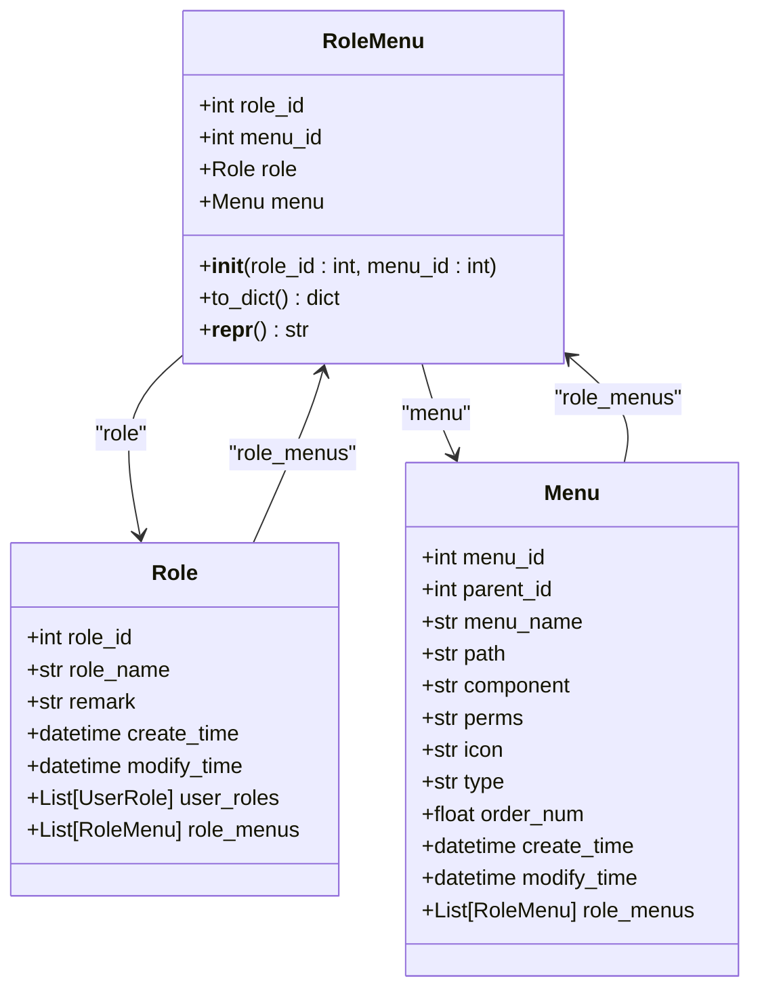
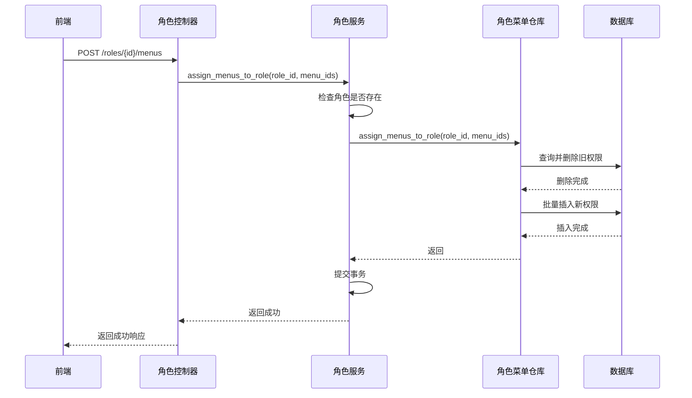

# 角色菜单关联 (RoleMenu)

<cite>
**本文档引用的文件**   
- [role_menu.py](file://AI-agent-backend\app\entity\role_menu.py)
- [role.py](file://AI-agent-backend\app\entity\role.py)
- [menu.py](file://AI-agent-backend\app\entity\menu.py)
- [role_menu_repository.py](file://AI-agent-backend\app\repository\role_menu_repository.py)
- [role_service.py](file://AI-agent-backend\app\service\role_service.py)
- [rbac_base.py](file://AI-agent-backend\app\entity\rbac_base.py)
</cite>

## 目录
1. [角色菜单关联设计概述](#角色菜单关联设计概述)
2. [数据库表结构与完整性约束](#数据库表结构与完整性约束)
3. [实体类实现与关系映射](#实体类实现与关系映射)
4. [权限分配业务流程分析](#权限分配业务流程分析)
5. [权限校验与菜单查询](#权限校验与菜单查询)
6. [数据库查询优化建议](#数据库查询优化建议)

## 角色菜单关联设计概述

角色菜单关联（RoleMenu）是基于角色的访问控制（RBAC）模型中的核心中间表，用于实现角色（Role）与菜单（Menu）之间的多对多关系。在本系统中，该设计允许一个角色拥有多个菜单权限，同时一个菜单也可以被分配给多个角色。这种灵活的权限模型是现代后台管理系统实现精细化权限控制的基础。

RoleMenu 表的设计遵循了数据库第三范式（3NF），通过将角色与菜单的关联关系独立成表，避免了数据冗余和更新异常。当管理员为某个角色分配菜单权限时，系统会在 `t_role_menu` 表中插入相应的记录。反之，当权限被撤销时，对应的记录也会被删除。这种设计确保了权限数据的准确性和一致性。

**中文(中文)**
- **角色菜单关联设计概述**：角色菜单关联设计概述
- **目录**：目录
- **数据库表结构与完整性约束**：数据库表结构与完整性约束
- **实体类实现与关系映射**：实体类实现与关系映射
- **权限分配业务流程分析**：权限分配业务流程分析
- **权限校验与菜单查询**：权限校验与菜单查询
- **数据库查询优化建议**：数据库查询优化建议
- **本文档引用的文件**：本文档引用的文件

## 数据库表结构与完整性约束

### 表结构定义

RoleMenu 中间表在数据库中对应 `t_role_menu` 表，其核心结构由两个字段构成：`role_id` 和 `menu_id`。这两个字段共同构成了该表的复合主键（Composite Primary Key），这是确保数据完整性的关键设计。

```sql
-- 逻辑表结构示意
CREATE TABLE t_role_menu (
    role_id INT NOT NULL,
    menu_id INT NOT NULL,
    PRIMARY KEY (role_id, menu_id),
    FOREIGN KEY (role_id) REFERENCES t_role(role_id),
    FOREIGN KEY (menu_id) REFERENCES t_menu(menu_id)
);
```

### 双主键与唯一性保证

将 `role_id` 和 `menu_id` 同时设置为主键，具有以下重要意义：
1.  **唯一性约束**：复合主键天然保证了 `(role_id, menu_id)` 组合的唯一性。这意味着同一个角色无法被重复分配同一个菜单权限，从根本上防止了数据冗余。
2.  **数据完整性**：主键约束强制要求这两个字段都不能为空（NOT NULL），确保了每条关联记录都是完整有效的。
3.  **外键引用**：`role_id` 和 `menu_id` 同时也是外键，分别引用 `t_role` 和 `t_menu` 表的主键。这建立了表间的参照完整性，确保了插入的 `role_id` 和 `menu_id` 必须在各自的主表中存在，防止了“孤儿”记录的产生。

这种双主键的设计是实现多对多关系的标准且高效的方式，它比使用单个自增ID作为主键并添加唯一索引的方式更符合语义，且在查询性能上通常更优。

**中文(中文)**
- **数据库表结构与完整性约束**：数据库表结构与完整性约束
- **表结构定义**：表结构定义
- **双主键与唯一性保证**：双主键与唯一性保证
- **逻辑表结构示意**：逻辑表结构示意
- **唯一性约束**：唯一性约束
- **数据完整性**：数据完整性
- **外键引用**：外键引用

**Section sources**
- [role_menu.py](file://AI-agent-backend\app\entity\role_menu.py#L17-L21)

## 实体类实现与关系映射

### RoleMenu 实体类

在代码层面，`RoleMenu` 实体类位于 `app/entity/role_menu.py` 文件中。该类继承自 `RBACBase`，并使用 SQLAlchemy ORM 框架进行数据库映射。



**Diagram sources**
- [role_menu.py](file://AI-agent-backend\app\entity\role_menu.py#L12-L60)
- [role.py](file://AI-agent-backend\app\entity\role.py#L39-L42)
- [menu.py](file://AI-agent-backend\app\entity\menu.py#L57-L57)

**Section sources**
- [role_menu.py](file://AI-agent-backend\app\entity\role_menu.py#L12-L60)
- [role.py](file://AI-agent-backend\app\entity\role.py#L39-L42)
- [menu.py](file://AI-agent-backend\app\entity\menu.py#L57-L57)

### 双向关系映射 (back_populates)

`RoleMenu` 类通过 `relationship` 函数与 `Role` 和 `Menu` 实体建立了双向关联：
- `role = relationship("Role", back_populates="role_menus")`：此行代码在 `RoleMenu` 实体中创建了一个 `role` 属性，它指向关联的 `Role` 实体对象。
- `menu = relationship("Menu", back_populates="role_menus")`：此行代码在 `RoleMenu` 实体中创建了一个 `menu` 属性，它指向关联的 `Menu` 实体对象。

与此同时，在 `Role` 和 `Menu` 实体中，也定义了反向的 `relationship`：
- 在 `Role` 类中：`role_menus = relationship("RoleMenu", back_populates="role")`
- 在 `Menu` 类中：`role_menus = relationship("RoleMenu", back_populates="menu")`

`back_populates` 参数是实现双向关系的关键。它告诉 SQLAlchemy，这两个 `relationship` 是同一关联的两个方向。这使得开发者可以方便地进行双向导航：
- 从一个 `Role` 对象出发，可以通过 `role.role_menus` 获取其所有关联的 `RoleMenu` 记录。
- 从一个 `RoleMenu` 对象出发，可以通过 `role_menu.role` 获取其关联的 `Role` 对象。

这种设计极大地简化了业务逻辑的编写，使得在处理角色和菜单数据时，可以像操作对象图一样自然。

**中文(中文)**
- **实体类实现与关系映射**：实体类实现与关系映射
- **RoleMenu 实体类**：RoleMenu 实体类
- **双向关系映射 (back_populates)**：双向关系映射 (back_populates)
- **classDiagram**：classDiagram

## 权限分配业务流程分析

### 服务层流程

权限分配的核心业务逻辑封装在 `RoleService` 类的 `assign_menus_to_role` 方法中，该方法位于 `app/service/role_service.py` 文件中。



**Diagram sources**
- [role_service.py](file://AI-agent-backend\app\service\role_service.py#L210-L213)
- [role_menu_repository.py](file://AI-agent-backend\app\repository\role_menu_repository.py#L128-L137)

**Section sources**
- [role_service.py](file://AI-agent-backend\app\service\role_service.py#L210-L213)
- [role_menu_repository.py](file://AI-agent-backend\app\repository\role_menu_repository.py#L128-L137)

### 详细流程说明

1.  **API 请求**：前端通过 `POST /roles/{role_id}/menus` 接口发起请求，携带需要分配的菜单ID列表。
2.  **控制器调用**：`role_controller.py` 中的 `assign_menus_to_role` 函数接收到请求，调用 `RoleService` 的 `assign_menus_to_role` 方法。
3.  **存在性检查**：`RoleService` 首先检查指定的 `role_id` 是否存在，如果不存在则返回错误。
4.  **仓库层操作**：`RoleService` 调用 `RoleMenuRepository` 的 `assign_menus_to_role` 方法来执行具体的数据库操作。
5.  **全量覆盖策略**：`RoleMenuRepository` 的 `assign_menus_to_role` 方法采用“先删除，后插入”的全量覆盖策略：
    -   **删除旧权限**：调用 `delete_by_role_id(role_id)` 方法，删除该角色在 `t_role_menu` 表中的所有现有记录。
    -   **分配新权限**：遍历传入的 `menu_ids` 列表，为每一个 `menu_id` 创建一个新的 `RoleMenu` 实体，并通过 `db.add()` 添加到数据库会话中。
6.  **事务提交**：`RoleService` 在完成仓库层调用后，调用 `db.commit()` 提交事务。如果过程中发生任何异常，会进行 `rollback` 回滚，保证数据一致性。

这种全量覆盖的模式简化了业务逻辑，避免了复杂的增删改查判断，特别适用于角色权限需要完全重新配置的场景。

**中文(中文)**
- **权限分配业务流程分析**：权限分配业务流程分析
- **服务层流程**：服务层流程
- **sequenceDiagram**：sequenceDiagram
- **详细流程说明**：详细流程说明
- **API 请求**：API 请求
- **控制器调用**：控制器调用
- **存在性检查**：存在性检查
- **仓库层操作**：仓库层操作
- **全量覆盖策略**：全量覆盖策略
- **删除旧权限**：删除旧权限
- **分配新权限**：分配新权限
- **事务提交**：事务提交

## 权限校验与菜单查询

### 高效获取用户菜单

在用户登录或需要渲染菜单时，系统需要根据用户的角色快速获取其可访问的菜单列表。这个过程的核心是通过 `JOIN` 查询来实现。

`RoleMenuRepository` 类中的 `get_menus_by_role_id` 方法是实现此功能的关键：

```python
def get_menus_by_role_id(self, role_id: int) -> List[Menu]:
    return self.db.query(Menu).join(
        RoleMenu, Menu.MENU_ID == RoleMenu.MENU_ID
    ).filter(RoleMenu.ROLE_ID == role_id).order_by(Menu.ORDER_NUM).all()
```

该查询的执行逻辑如下：
1.  **JOIN 操作**：`query(Menu).join(RoleMenu, Menu.MENU_ID == RoleMenu.MENU_ID)` 将 `t_menu` 表和 `t_role_menu` 表进行内连接（INNER JOIN），连接条件是两表的 `menu_id` 字段相等。
2.  **过滤条件**：`.filter(RoleMenu.ROLE_ID == role_id)` 筛选出与指定 `role_id` 相关的记录。
3.  **排序**：`.order_by(Menu.ORDER_NUM)` 根据菜单的 `order_num` 字段进行排序，确保返回的菜单列表是有序的。
4.  **返回结果**：最终返回一个 `Menu` 实体对象的列表。

这种方法非常高效，因为它将多次查询（先查角色菜单关联，再查菜单详情）合并为一次数据库查询，大大减少了数据库交互次数和网络开销。

### 获取权限标识

除了菜单列表，系统还需要获取角色的权限标识（`perms`），用于前端按钮级别的权限控制。`get_permissions_by_role_id` 方法通过类似的 `JOIN` 查询实现：

```python
def get_permissions_by_role_id(self, role_id: int) -> List[str]:
    permissions = self.db.query(Menu.PERMS).join(
        RoleMenu, Menu.MENU_ID == RoleMenu.MENU_ID
    ).filter(
        RoleMenu.ROLE_ID == role_id,
        Menu.PERMS.isnot(None)  # 只获取有权限标识的菜单
    ).all()
    return [perm[0] for perm in permissions if perm[0]]
```

此查询直接从 `Menu` 表中选择 `perms` 字段，并通过 `JOIN` 和 `filter` 精准定位到该角色拥有的、且具有权限标识的菜单。

**中文(中文)**
- **权限校验与菜单查询**：权限校验与菜单查询
- **高效获取用户菜单**：高效获取用户菜单
- **JOIN 操作**：JOIN 操作
- **过滤条件**：过滤条件
- **排序**：排序
- **返回结果**：返回结果
- **获取权限标识**：获取权限标识

**Section sources**
- [role_menu_repository.py](file://AI-agent-backend\app\repository\role_menu_repository.py#L45-L91)
- [role_menu_repository.py](file://AI-agent-backend\app\repository\role_menu_repository.py#L174-L194)

## 数据库查询优化建议

尽管 `JOIN` 查询已经很高效，但为了应对数据量增长，可以采取以下优化措施：

### 创建复合索引

最有效的优化手段是在 `t_role_menu` 表上创建复合索引。考虑到最常见的查询是根据 `role_id` 查找所有关联的菜单，建议创建一个以 `role_id` 为前导列的复合索引。

```sql
-- 建议的复合索引
CREATE INDEX idx_role_menu_role_id_menu_id ON t_role_menu (role_id, menu_id);
```

**优化原理**：
-   **覆盖索引**：这个索引包含了查询 `get_menus_by_role_id` 所需的所有字段（`role_id` 和 `menu_id`）。当执行 `JOIN` 查询时，数据库引擎可以直接在索引树中完成 `role_id` 的过滤和 `menu_id` 的查找，而无需回表查询 `t_role_menu` 的数据页，这称为“覆盖索引”（Covering Index），能极大提升查询速度。
-   **索引顺序**：将 `role_id` 放在前面，是因为 `WHERE` 子句中的 `RoleMenu.ROLE_ID == role_id` 是等值查询，选择性高，可以快速定位到索引中的一个范围。`menu_id` 作为第二列，可以保证在这个范围内 `menu_id` 的有序性，便于后续的 `JOIN` 操作。

### 其他优化考虑

-   **监控慢查询**：在生产环境中启用慢查询日志，定期分析执行时间较长的SQL，针对性地进行优化。
-   **缓存策略**：对于不频繁变动的菜单权限数据，可以考虑使用Redis等缓存中间件。当角色权限发生变更时，主动更新或删除缓存，从而将高频的权限查询从数据库转移到内存中，显著降低数据库压力。

通过以上优化，可以确保即使在角色和菜单数量庞大的情况下，权限校验和菜单加载依然能够保持毫秒级的响应速度。

**中文(中文)**
- **数据库查询优化建议**：数据库查询优化建议
- **创建复合索引**：创建复合索引
- **优化原理**：优化原理
- **覆盖索引**：覆盖索引
- **索引顺序**：索引顺序
- **其他优化考虑**：其他优化考虑
- **监控慢查询**：监控慢查询
- **缓存策略**：缓存策略

**Section sources**
- [role_menu_repository.py](file://AI-agent-backend\app\repository\role_menu_repository.py#L45-L91)