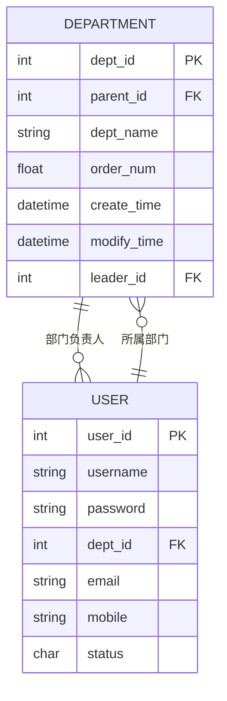
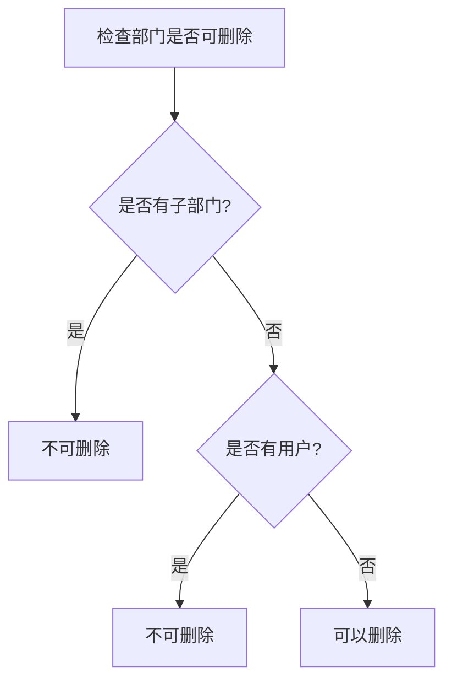
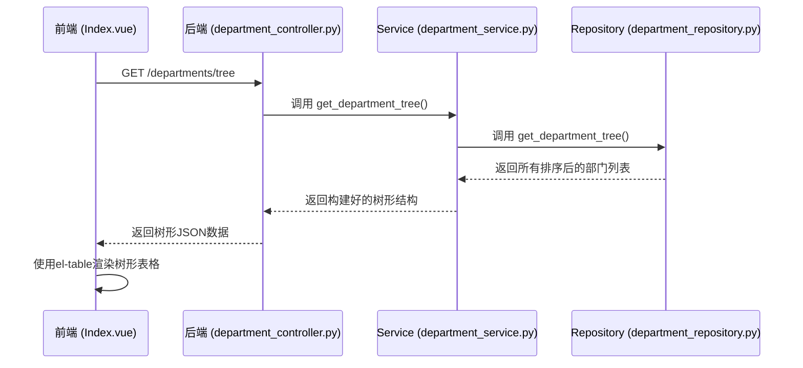

# 部门实体 (Department)

<cite>
**本文档引用的文件**   
- [department.py](file://AI-agent-backend\app\entity\department.py)
- [department_controller.py](file://AI-agent-backend\app\controller\department_controller.py)
- [department_service.py](file://AI-agent-backend\app\service\department_service.py)
- [department_dto.py](file://AI-agent-backend\app\dto\department_dto.py)
- [department_repository.py](file://AI-agent-backend\app\repository\department_repository.py)
- [Index.vue](file://AI-agent-frontend\src\views\system\department\Index.vue)
</cite>

## 目录
1. [部门实体字段结构与约束](#部门实体字段结构与约束)
2. [组织架构树与层级归属逻辑](#组织架构树与层级归属逻辑)
3. [部门负责人关联与权限应用](#部门负责人关联与权限应用)
4. [部门状态管理机制](#部门状态管理机制)
5. [部门树查询与展示优化](#部门树查询与展示优化)

## 部门实体字段结构与约束

部门实体（Department）是系统组织架构的核心数据模型，定义了部门的基本属性和约束条件。该实体映射到数据库中的 `t_dept` 表，其字段结构如下：

- **dept_id**: 部门ID，整数类型，主键，自增。唯一标识一个部门。
- **parent_id**: 上级部门ID，整数类型，必填。用于构建部门间的父子关系，值为0时表示该部门为顶级部门。
- **dept_name**: 部门名称，字符串类型（最大100字符），必填。在系统中必须唯一，用于标识部门。
- **order_num**: 排序号，浮点数类型，可选。用于控制同一父级下的部门显示顺序。
- **create_time**: 创建时间，日期时间类型，可选。记录部门创建的时间，默认值为当前UTC时间。
- **modify_time**: 修改时间，日期时间类型，可选。记录部门信息最后一次修改的时间，更新时自动设置。

此外，实体中还定义了与 `User` 实体的关联关系：
- **users**: 一个部门可以包含多个用户，通过 `User` 实体中的 `dept_id` 外键建立一对多关系。

**Section sources**
- [department.py](file://AI-agent-backend\app\entity\department.py#L14-L101)

## 组织架构树与层级归属逻辑

部门实体通过 `parent_id` 字段构建了一个树形的组织架构。这种设计允许系统形成多层级的部门结构，例如：公司 -> 部门 -> 小组。

层级归属逻辑的核心在于 `parent_id` 字段：
- 当 `parent_id = 0` 时，该部门为根节点（顶级部门）。
- 当 `parent_id` 为其他部门的 `dept_id` 时，该部门是其子部门。

在代码中，`Department` 实体提供了一个便捷方法 `is_top_level()` 来判断一个部门是否为顶级部门。此逻辑在用户管理中至关重要，它决定了用户在组织架构中的位置。用户的部门归属（`User.dept_id`）直接决定了其在树中的位置，从而影响数据权限的范围。

**Section sources**
- [department.py](file://AI-agent-backend\app\entity\department.py#L75-L80)

## 部门负责人关联与权限应用

虽然在当前分析的 `department.py` 文件中未直接定义 `leader_id` 字段，但通过分析前端界面文件 `Index.vue` 可以确认，部门实体在实际应用中包含 `leader_id` 字段，用于关联部门负责人。

**Diagram sources**
- [department.py](file://AI-agent-backend\app\entity\department.py#L14-L101)
- [user.py](file://AI-agent-backend\app\entity\user.py#L14-L214)
- [Index.vue](file://AI-agent-frontend\src\views\system\department\Index.vue#L130-L135)

`leader_id` 是一个外键，关联到 `User` 实体的 `user_id`，表示该部门的负责人。这一关联在系统中有多种潜在应用：
1.  **权限审批流程**：在涉及部门的审批流程（如请假、报销）中，系统可以自动将审批任务分配给 `leader_id` 对应的用户。
2.  **数据隔离与可见性**：在某些数据隔离场景下，部门负责人可能拥有查看或管理其部门内所有用户数据的权限。
3.  **通知与消息**：系统可以向部门负责人发送与其部门相关的通知或报告。

**Section sources**
- [Index.vue](file://AI-agent-frontend\src\views\system\department\Index.vue#L130-L135)

## 部门状态管理机制

部门实体本身未直接包含状态字段（如 `is_active`），但前端界面 `Index.vue` 显示了“状态”列，表明系统支持部门的启用/禁用功能。这暗示状态管理可能通过以下方式实现：
- 在数据库表中存在一个未在当前Python实体中映射的状态字段。
- 或者，状态是通过其他逻辑（如软删除）来体现。

尽管如此，系统通过 `DepartmentService` 提供了强大的状态检查机制。`can_delete()` 方法检查一个部门是否可以被删除，其逻辑是：**当且仅当该部门既没有子部门也没有关联用户时，才允许删除**。

**Diagram sources**
- [department_service.py](file://AI-agent-backend\app\service\department_service.py#L228-L254)
- [department_repository.py](file://AI-agent-backend\app\repository\department_repository.py#L128-L148)

此机制对下属用户的权限有间接影响。当一个部门被删除时，其所有下属用户必须先被移出或删除，这会直接改变这些用户的部门归属和相应的数据权限范围。此外，如果部门状态与用户权限挂钩，禁用一个部门可能会导致其下属用户失去某些特定权限。

**Section sources**
- [department_service.py](file://AI-agent-backend\app\service\department_service.py#L228-L254)
- [department_repository.py](file://AI-agent-backend\app\repository\department_repository.py#L128-L148)

## 部门树查询与展示优化策略

部门树的查询与展示是一个涉及前后端协作的优化过程。

**后端查询策略**：
1.  **数据获取**：`DepartmentRepository.get_department_tree()` 方法通过一次数据库查询获取所有部门，并按 `order_num` 排序。
2.  **树形构建**：`DepartmentService.get_department_tree()` 方法在内存中将扁平的部门列表构建成树形结构。它使用一个字典（`dept_dict`）来快速查找部门，并通过遍历 `parent_id` 来建立父子关系。

**前端展示优化策略**：
1.  **组件选择**：前端使用 `Element Plus` 的 `el-table` 组件，并启用其 `tree-props` 功能来展示树形数据。
2.  **交互优化**：提供了“展开全部”和“折叠全部”按钮，允许用户一键操作整个树的展开状态，极大提升了用户体验。
3.  **视觉优化**：通过CSS深度选择器（`:deep`）为不同层级的行设置了不同的背景色（如一级为 `#fafafa`，二级为 `#f5f5f5`），使层级结构更加清晰。
4.  **搜索与重置**：提供了按部门名称搜索的功能，并有重置按钮快速清空搜索条件。

**Diagram sources**
- [department_controller.py](file://AI-agent-backend\app\controller\department_controller.py#L78-L112)
- [department_service.py](file://AI-agent-backend\app\service\department_service.py#L89-L129)
- [department_repository.py](file://AI-agent-backend\app\repository\department_repository.py#L68-L78)
- [Index.vue](file://AI-agent-frontend\src\views\system\department\Index.vue#L150-L180)

**Section sources**
- [department_controller.py](file://AI-agent-backend\app\controller\department_controller.py#L78-L112)
- [department_service.py](file://AI-agent-backend\app\service\department_service.py#L89-L129)
- [department_repository.py](file://AI-agent-backend\app\repository\department_repository.py#L68-L78)
- [Index.vue](file://AI-agent-frontend\src\views\system\department\Index.vue#L150-L180)