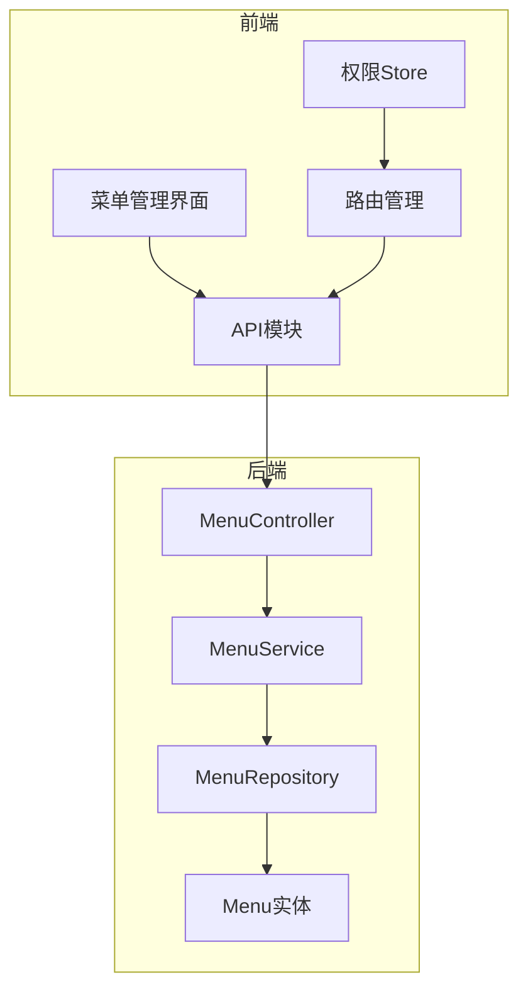
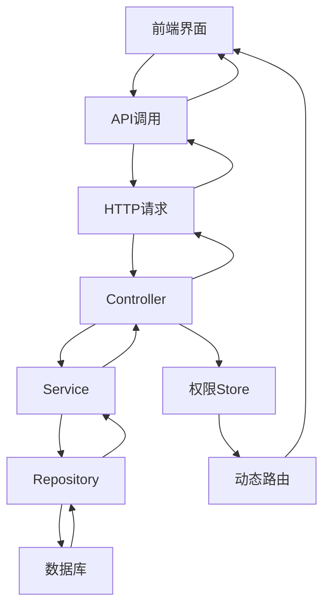
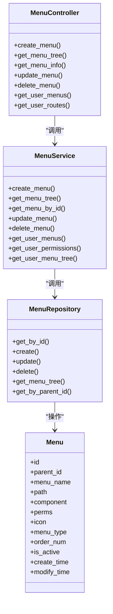
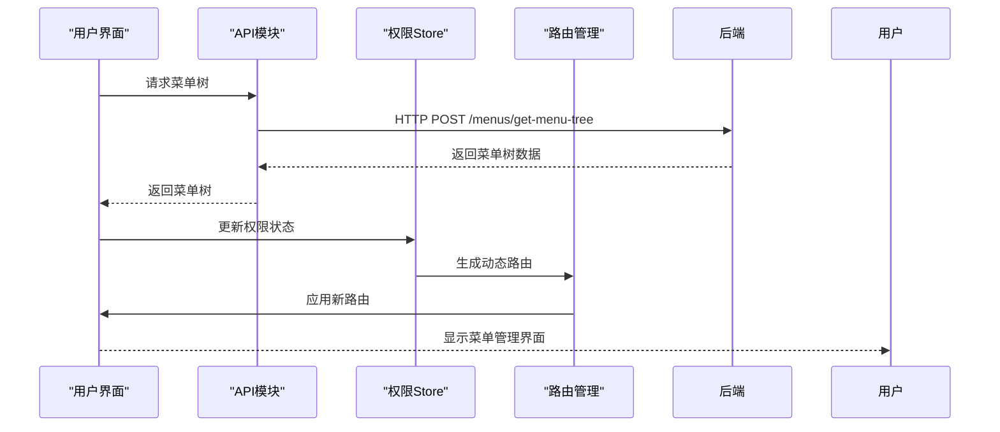
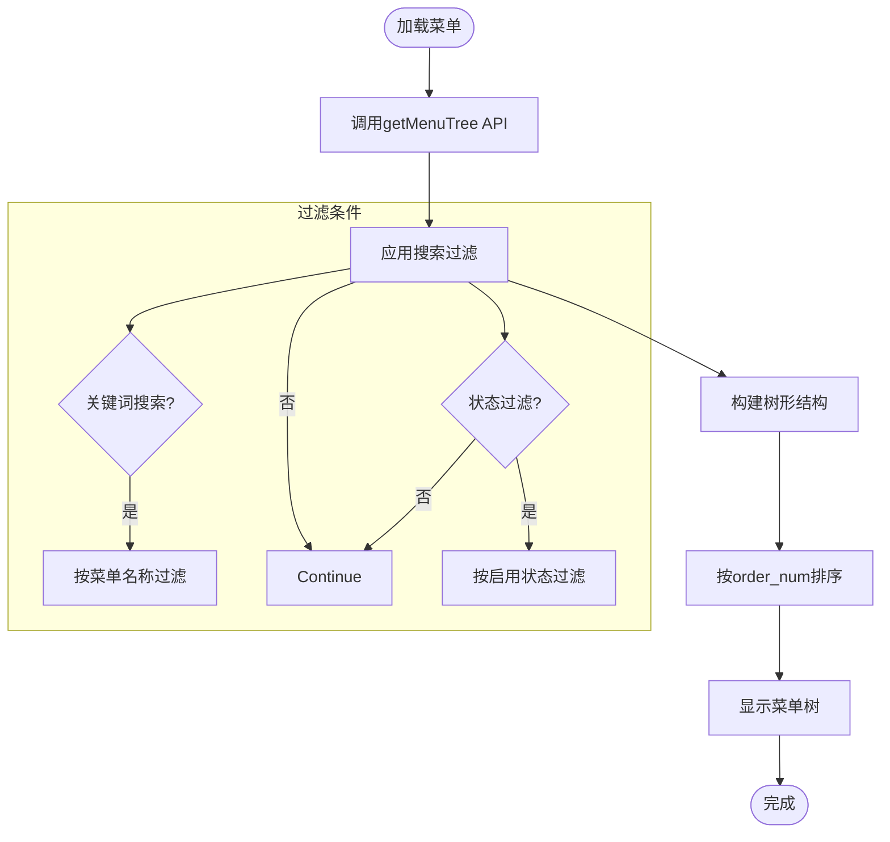
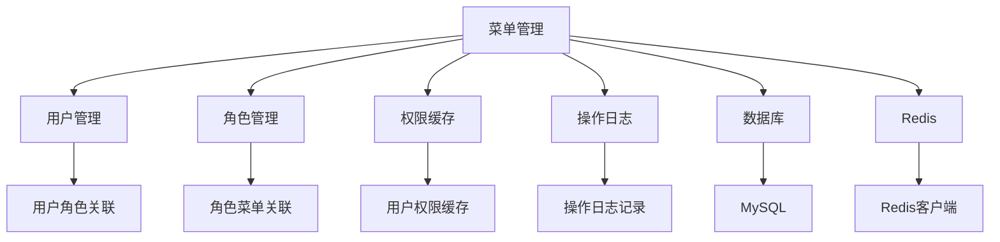

# 菜单管理功能

<cite>
**本文档引用的文件**
- [menu_controller.py](file://AI-agent-backend/app/controller/menu_controller.py)
- [menu_service.py](file://AI-agent-backend/app/service/menu_service.py)
- [menu.py](file://AI-agent-backend/app/entity/menu.py)
- [menu_dto.py](file://AI-agent-backend/app/dto/menu_dto.py)
- [menu_repository.py](file://AI-agent-backend/app/repository/menu_repository.py)
- [menu.ts](file://AI-agent-frontend/src/api/modules/menu.ts)
- [Index.vue](file://AI-agent-frontend/src/views/system/menu/Index.vue)
- [permission.ts](file://AI-agent-frontend/src/store/modules/permission.ts)
- [index.ts](file://AI-agent-frontend/src/router/index.ts)
</cite>

## 目录
1. [简介](#简介)
2. [项目结构](#项目结构)
3. [核心组件](#核心组件)
4. [架构概述](#架构概述)
5. [详细组件分析](#详细组件分析)
6. [依赖分析](#依赖分析)
7. [性能考虑](#性能考虑)
8. [故障排除指南](#故障排除指南)
9. [结论](#结论)

## 简介
菜单管理功能是AI智能代理测试平台的核心权限控制模块，负责管理系统导航结构、动态路由生成和权限分配。该功能实现了完整的菜单树结构管理，支持动态路由、搜索过滤、权限校验等特性，为系统提供灵活的导航和权限控制能力。

## 项目结构
菜单管理功能采用前后端分离架构，后端基于FastAPI框架实现RESTful API，前端使用Vue3 + Element Plus构建用户界面。系统通过角色-菜单关联实现细粒度的权限控制，支持菜单的增删改查、排序、状态管理等操作。

**图示来源**
- [Index.vue](file://AI-agent-frontend/src/views/system/menu/Index.vue)
- [menu.ts](file://AI-agent-frontend/src/api/modules/menu.ts)
- [menu_controller.py](file://AI-agent-backend/app/controller/menu_controller.py)

**本节来源**
- [menu_controller.py](file://AI-agent-backend/app/controller/menu_controller.py)
- [Index.vue](file://AI-agent-frontend/src/views/system/menu/Index.vue)

## 核心组件
菜单管理功能的核心组件包括菜单实体、服务层、控制器和前端界面。系统通过DTO（数据传输对象）在各层之间传递数据，确保类型安全和数据一致性。权限控制通过角色-菜单关联表实现，支持复杂的权限校验逻辑。

**本节来源**
- [menu.py](file://AI-agent-backend/app/entity/menu.py)
- [menu_service.py](file://AI-agent-backend/app/service/menu_service.py)
- [menu_controller.py](file://AI-agent-backend/app/controller/menu_controller.py)
- [menu_dto.py](file://AI-agent-backend/app/dto/menu_dto.py)

## 架构概述
菜单管理功能采用典型的分层架构，包括表现层（Controller）、业务逻辑层（Service）、数据访问层（Repository）和数据模型层（Entity）。前端通过API模块与后端交互，权限Store负责管理动态路由和权限信息，实现按需加载和权限校验。

**图示来源**
- [menu_controller.py](file://AI-agent-backend/app/controller/menu_controller.py)
- [menu_service.py](file://AI-agent-backend/app/service/menu_service.py)
- [menu_repository.py](file://AI-agent-backend/app/repository/menu_repository.py)
- [permission.ts](file://AI-agent-frontend/src/store/modules/permission.ts)

## 详细组件分析

### 后端组件分析
菜单管理功能的后端组件实现了完整的CRUD操作和业务逻辑处理。系统通过装饰器实现操作日志记录，确保所有变更可追溯。服务层负责业务规则验证，如删除菜单时检查子菜单和角色关联，防止数据不一致。

**图示来源**
- [menu_controller.py](file://AI-agent-backend/app/controller/menu_controller.py)
- [menu_service.py](file://AI-agent-backend/app/service/menu_service.py)
- [menu_repository.py](file://AI-agent-backend/app/repository/menu_repository.py)
- [menu.py](file://AI-agent-backend/app/entity/menu.py)

**本节来源**
- [menu_controller.py](file://AI-agent-backend/app/controller/menu_controller.py)
- [menu_service.py](file://AI-agent-backend/app/service/menu_service.py)
- [menu_repository.py](file://AI-agent-backend/app/repository/menu_repository.py)
- [menu.py](file://AI-agent-backend/app/entity/menu.py)

### 前端组件分析
前端菜单管理界面采用Vue3组合式API开发，使用Element Plus组件库构建用户界面。系统通过Pinia状态管理实现权限信息的全局管理，支持动态路由的按需加载。界面支持树形表格展示、搜索过滤、排序调整等交互功能。

**图示来源**
- [Index.vue](file://AI-agent-frontend/src/views/system/menu/Index.vue)
- [menu.ts](file://AI-agent-frontend/src/api/modules/menu.ts)
- [permission.ts](file://AI-agent-frontend/src/store/modules/permission.ts)
- [index.ts](file://AI-agent-frontend/src/router/index.ts)

**本节来源**
- [Index.vue](file://AI-agent-frontend/src/views/system/menu/Index.vue)
- [menu.ts](file://AI-agent-frontend/src/api/modules/menu.ts)
- [permission.ts](file://AI-agent-frontend/src/store/modules/permission.ts)
- [index.ts](file://AI-agent-frontend/src/router/index.ts)

### 菜单树结构分析
菜单树结构采用递归设计，支持无限层级的嵌套。系统通过parent_id字段建立父子关系，使用order_num字段控制排序。前端使用Element Plus的树形表格组件展示菜单结构，支持展开/折叠、拖拽排序等操作。

**图示来源**
- [menu_service.py](file://AI-agent-backend/app/service/menu_service.py)
- [menu_repository.py](file://AI-agent-backend/app/repository/menu_repository.py)
- [Index.vue](file://AI-agent-frontend/src/views/system/menu/Index.vue)

**本节来源**
- [menu_service.py](file://AI-agent-backend/app/service/menu_service.py)
- [menu_repository.py](file://AI-agent-backend/app/repository/menu_repository.py)
- [Index.vue](file://AI-agent-frontend/src/views/system/menu/Index.vue)

## 依赖分析
菜单管理功能依赖多个核心模块，包括用户管理、角色管理、权限缓存等。系统通过角色-菜单关联表实现权限分配，使用Redis缓存用户权限信息以提高性能。前后端通过标准化的API接口进行通信，确保松耦合和可维护性。

**图示来源**
- [menu_service.py](file://AI-agent-backend/app/service/menu_service.py)
- [menu_repository.py](file://AI-agent-backend/app/repository/menu_repository.py)
- [permission.ts](file://AI-agent-frontend/src/store/modules/permission.ts)

**本节来源**
- [menu_service.py](file://AI-agent-backend/app/service/menu_service.py)
- [menu_repository.py](file://AI-agent-backend/app/repository/menu_repository.py)
- [permission.ts](file://AI-agent-frontend/src/store/modules/permission.ts)

## 性能考虑
菜单管理功能在设计时充分考虑了性能优化。系统使用Redis缓存用户权限信息，避免频繁的数据库查询。菜单树结构在服务层预处理，减少网络传输数据量。前端采用虚拟滚动技术，确保大数据量下的流畅体验。

## 故障排除指南
常见问题包括菜单无法删除、权限不生效、路由加载失败等。解决方案包括检查子菜单和角色关联、清除权限缓存、重新生成动态路由等。系统提供详细的操作日志，便于问题定位和追踪。

**本节来源**
- [menu_service.py](file://AI-agent-backend/app/service/menu_service.py)
- [menu_controller.py](file://AI-agent-backend/app/controller/menu_controller.py)
- [permission.ts](file://AI-agent-frontend/src/store/modules/permission.ts)

## 结论
菜单管理功能实现了完整的导航结构管理和权限控制，支持灵活的菜单配置和动态路由生成。系统架构清晰，层次分明，具有良好的可扩展性和可维护性。通过前后端协同工作，为用户提供直观的菜单管理界面和安全的权限控制机制。