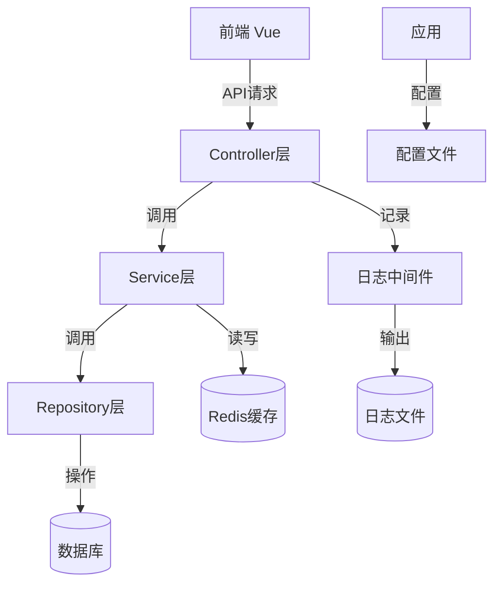
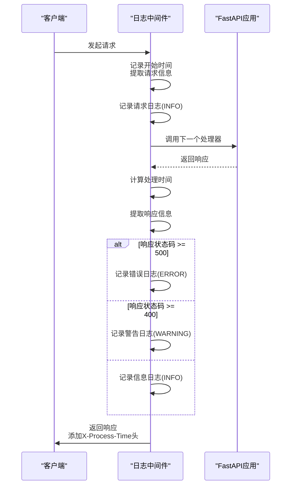
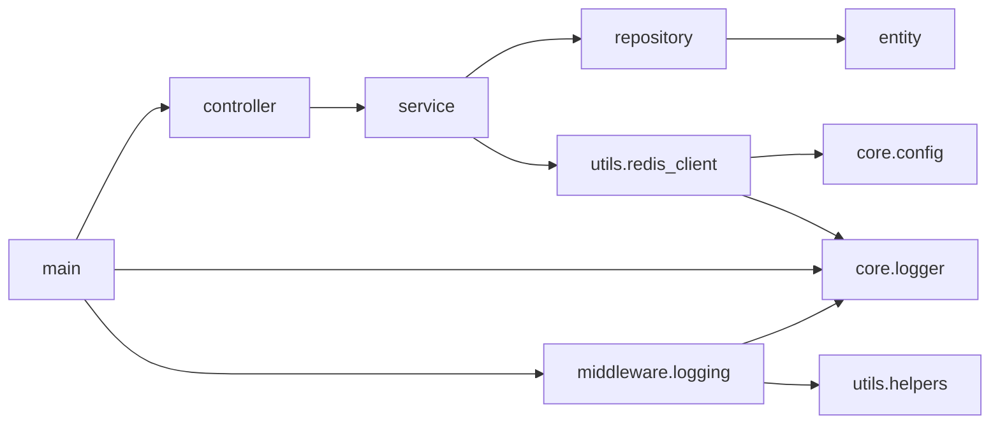

# 调试技巧与性能优化

<cite>
**本文档引用文件**  
- [main.py](file://AI-agent-backend/main.py#L1-L217)
- [logger.py](file://AI-agent-backend/app/core/logger.py#L1-L99)
- [logging.py](file://AI-agent-backend/app/middleware/logging.py#L1-L275)
- [redis_client.py](file://AI-agent-backend/app/utils/redis_client.py#L1-L338)
- [memory_cache.py](file://AI-agent-backend/app/utils/memory_cache.py)
- [config.py](file://AI-agent-backend/app/core/config.py)
- [helpers.py](file://AI-agent-backend/app/utils/helpers.py)
</cite>

## 目录
1. [简介](#简介)
2. [项目结构](#项目结构)
3. [核心组件](#核心组件)
4. [架构概览](#架构概览)
5. [详细组件分析](#详细组件分析)
6. [依赖分析](#依赖分析)
7. [性能考虑](#性能考虑)
8. [故障排除指南](#故障排除指南)
9. [结论](#结论)

## 简介
本文档旨在分享AI代理测试平台项目的调试最佳实践与性能优化策略。涵盖后端日志链路追踪、Redis缓存集成、数据库迁移管理，以及前端性能监控、加载提示与懒加载优化等关键技术。通过具体代码实现与架构设计，帮助开发者提升系统可观测性、响应速度与用户体验。

## 项目结构
项目采用前后端分离架构，包含AI-agent-backend（后端）与AI-agent-frontend（前端）两大模块。后端基于FastAPI构建，采用五层企业级架构（Controller、Service、Repository、Entity、DTO），并集成日志、缓存、数据库等核心工具。前端基于Vue 3 + TypeScript，使用Vite构建，采用模块化组件设计。

```mermaid
graph TB
subgraph "后端 AI-agent-backend"
A[main.py] --> B[controller]
B --> C[service]
C --> D[repository]
D --> E[entity]
C --> F[utils.redis_client]
A --> G[core.logger]
A --> H[middleware.logging]
end
subgraph "前端 AI-agent-frontend"
I[main.ts] --> J[router]
J --> K[views]
K --> L[components]
I --> M[utils.nprogress]
end
A < --> |HTTP API| I
```

**图示来源**
- [main.py](file://AI-agent-backend/main.py#L1-L217)
- [app目录结构](file://AI-agent-backend/app/)
- [src目录结构](file://AI-agent-frontend/src/)

## 核心组件
后端核心组件包括：
- **main.py**：应用入口，负责初始化FastAPI实例、注册路由、配置中间件及生命周期管理。
- **core/logger.py**：日志配置模块，使用loguru统一管理日志输出格式、级别、文件旋转等。
- **middleware/logging.py**：日志中间件，自动记录每个HTTP请求的详细信息，形成完整的请求链路日志。
- **utils/redis_client.py**：缓存客户端，封装Redis操作，支持自动降级至内存缓存，保障服务高可用。

**本节来源**
- [main.py](file://AI-agent-backend/main.py#L1-L217)
- [logger.py](file://AI-agent-backend/app/core/logger.py#L1-L99)
- [logging.py](file://AI-agent-backend/app/middleware/logging.py#L1-L275)
- [redis_client.py](file://AI-agent-backend/app/utils/redis_client.py#L1-L338)

## 架构概览
系统采用分层架构，从前端到后端形成清晰的数据流与控制流。前端通过API调用后端服务，后端通过Controller接收请求，经由Service协调业务逻辑，Repository访问数据库，并通过Entity映射数据模型。关键性能优化点包括日志中间件、Redis缓存和数据库连接管理。



**图示来源**
- [main.py](file://AI-agent-backend/main.py#L1-L217)
- [controller目录](file://AI-agent-backend/app/controller/)
- [service目录](file://AI-agent-backend/app/service/)
- [repository目录](file://AI-agent-backend/app/repository/)
- [entity目录](file://AI-agent-backend/app/entity/)
- [logging.py](file://AI-agent-backend/app/middleware/logging.py#L1-L275)
- [redis_client.py](file://AI-agent-backend/app/utils/redis_client.py#L1-L338)

## 详细组件分析
### 后端日志链路追踪
通过`core.logger`和`middleware.logging`中间件实现完整的请求链路日志记录。`core.logger`使用loguru配置统一的日志格式、输出目标（控制台与文件）及轮转策略。`LoggingMiddleware`作为HTTP中间件，在请求处理前后自动提取并记录请求与响应的详细信息。

#### 日志中间件实现


**图示来源**
- [logging.py](file://AI-agent-backend/app/middleware/logging.py#L1-L275)
- [logger.py](file://AI-agent-backend/app/core/logger.py#L1-L99)

**本节来源**
- [logging.py](file://AI-agent-backend/app/middleware/logging.py#L1-L275)
- [logger.py](file://AI-agent-backend/app/core/logger.py#L1-L99)

### Redis缓存优化
通过`utils.redis_client`模块集成Redis缓存，有效减少数据库查询压力。`CacheClient`类提供统一的缓存接口，支持自动降级：当Redis服务不可用时，自动切换至内存缓存（`memory_cache.py`），保证服务基本可用性。

#### 缓存客户端工作流程
```mermaid
flowchart TD
Start([初始化]) --> CheckRedis["检查REDIS_ENABLED配置"]
CheckRedis --> |启用| TryConnect["尝试连接Redis"]
TryConnect --> |成功| SetRedis["设置is_redis=True<br/>client=Redis实例"]
TryConnect --> |失败| UseMemory["使用MemoryCache实例"]
CheckRedis --> |禁用| UseMemory
UseMemory --> LogInfo["记录日志：使用内存缓存"]
SetRedis --> LogSuccess["记录日志：Redis初始化成功"]
LogSuccess --> End([初始化完成])
LogInfo --> End
subgraph "set方法"
SetStart([set(key, value, ttl)]) --> CheckAvail["检查is_available()"]
CheckAvail --> |不可用| ReturnFalse["返回False"]
CheckAvail --> |可用| IsRedis["判断is_redis"]
IsRedis --> |是| Serialize["序列化value<br/>(JSON或Pickle)"]
Serialize --> SetRedisKey["setex(cache_key, ttl, serialized_value)"]
SetRedisKey --> |成功| LogDebug["记录DEBUG日志"]
SetRedisKey --> ReturnResult["返回结果"]
IsRedis --> |否| SetMemory["调用MemoryCache.set()"]
SetMemory --> ReturnResult
end
```

**图示来源**
- [redis_client.py](file://AI-agent-backend/app/utils/redis_client.py#L1-L338)
- [memory_cache.py](file://AI-agent-backend/app/utils/memory_cache.py)

**本节来源**
- [redis_client.py](file://AI-agent-backend/app/utils/redis_client.py#L1-L338)
- [memory_cache.py](file://AI-agent-backend/app/utils/memory_cache.py)

### 数据库迁移管理
使用Alembic进行数据库模式迁移管理。Alembic通过`alembic.ini`配置文件和`alembic/env.py`环境脚本，与项目数据库配置（`db/session.py`）集成，支持版本化、可逆的数据库变更。通过`scripts/run_migrations.py`脚本可自动化执行迁移。

**本节来源**
- [alembic.ini](file://AI-agent-backend/alembic.ini)
- [alembic/env.py](file://AI-agent-backend/alembic/env.py)
- [scripts/run_migrations.py](file://AI-agent-backend/scripts/run_migrations.py)
- [db/session.py](file://AI-agent-backend/app/db/session.py)

### 前端性能优化
前端通过多种技术提升用户体验与性能：
- **nprogress.ts**：集成NProgress.js，在页面路由切换时显示加载进度条，提升用户感知。
- **路由懒加载**：在`router/index.ts`中使用动态`import()`语法，实现视图组件的按需加载，显著减少首屏包体积。
- **浏览器开发者工具**：利用Chrome DevTools的Performance面板分析组件渲染性能，识别重渲染、长任务等瓶颈。

**本节来源**
- [utils/nprogress.ts](file://AI-agent-frontend/src/utils/nprogress.ts)
- [router/index.ts](file://AI-agent-frontend/src/router/index.ts)
- [views目录](file://AI-agent-frontend/src/views/)

## 依赖分析
项目依赖关系清晰，各层职责分明。Controller层依赖Service层，Service层依赖Repository层和Utils工具。关键工具如日志、缓存被多层复用。外部依赖通过`pyproject.toml`（后端）和`package.json`（前端）管理。



**图示来源**
- [main.py](file://AI-agent-backend/main.py#L1-L217)
- [controller目录](file://AI-agent-backend/app/controller/)
- [service目录](file://AI-agent-backend/app/service/)
- [repository目录](file://AI-agent-backend/app/repository/)
- [entity目录](file://AI-agent-backend/app/entity/)
- [redis_client.py](file://AI-agent-backend/app/utils/redis_client.py#L1-L338)
- [logger.py](file://AI-agent-backend/app/core/logger.py#L1-L99)
- [logging.py](file://AI-agent-backend/app/middleware/logging.py#L1-L275)
- [helpers.py](file://AI-agent-backend/app/utils/helpers.py)

**本节来源**
- [main.py](file://AI-agent-backend/main.py#L1-L217)
- [app目录结构](file://AI-agent-backend/app/)
- [pyproject.toml](file://pyproject.toml)

## 性能考虑
### 常见性能瓶颈与解决方案
- **N+1查询问题**：在查询主实体（如用户）时，因关联实体（如角色）的懒加载导致多次数据库查询。**解决方案**：在Repository层使用SQLAlchemy的`joinedload`或`selectinload`进行预加载。
- **高频小查询**：对不常变更的配置数据频繁查询数据库。**解决方案**：使用`utils.redis_client`进行缓存，设置合理TTL。
- **大对象序列化**：在日志中记录过大的请求体。**解决方案**：日志中间件限制记录的请求体大小（如1KB），过大的内容仅记录大小提示。

### 缓存策略
- **读多写少数据**：如菜单、部门信息，优先从Redis读取，更新时同步失效缓存。
- **计算密集型结果**：将复杂计算结果缓存，避免重复执行。
- **降级策略**：`CacheClient`内置Redis连接失败时的内存缓存降级，保障核心功能可用。

## 故障排除指南
- **日志未输出**：检查`core/logger.py`中的`setup_logging()`是否被调用，确认日志文件路径权限。
- **Redis连接失败**：检查`config.py`中的`REDIS_URL`配置是否正确，确认Redis服务运行状态。
- **缓存未生效**：检查`CacheClient.set()`和`get()`的键名是否一致，确认TTL设置。
- **前端加载缓慢**：使用浏览器Network面板分析资源加载，检查是否启用了路由懒加载。

**本节来源**
- [logger.py](file://AI-agent-backend/app/core/logger.py#L1-L99)
- [redis_client.py](file://AI-agent-backend/app/utils/redis_client.py#L1-L338)
- [config.py](file://AI-agent-backend/app/core/config.py)

## 结论
本项目通过系统化的调试与性能优化策略，构建了高可观测性、高性能的AI代理测试平台。后端利用精细化的日志链路追踪和Redis缓存机制，有效提升了系统稳定性和响应速度。前端通过加载提示和懒加载技术，优化了用户体验。开发者应持续关注N+1查询等常见瓶颈，善用工具进行性能分析，确保系统在高负载下依然保持良好表现。