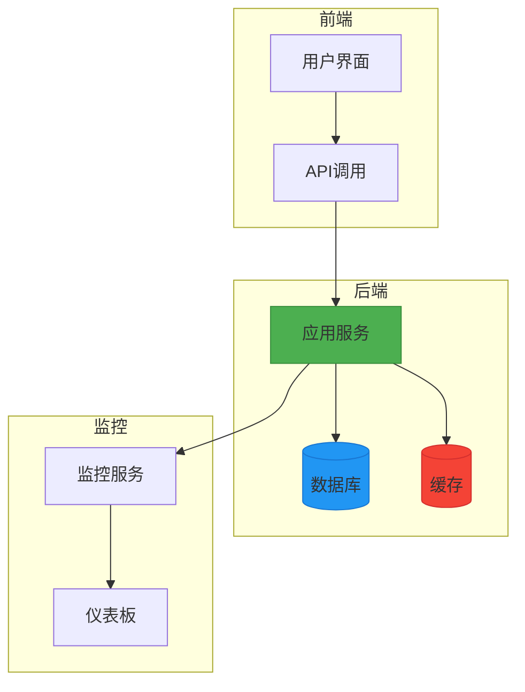

# 服务编排

<cite>
**本文档引用的文件**   
- [docker-compose.yml](file://AI-agent-backend/docker-compose.yml)
- [docker-compose.dev.yml](file://AI-agent-backend/docker-compose.dev.yml)
- [run_migrations.py](file://AI-agent-backend/scripts/run_migrations.py)
- [alembic.ini](file://AI-agent-backend/alembic.ini)
- [session.py](file://AI-agent-backend/app/db/session.py)
- [config.py](file://AI-agent-backend/app/core/config.py)
- [main.py](file://AI-agent-backend/main.py)
- [init_db.py](file://AI-agent-backend/scripts/init_db.py)
- [env.py](file://AI-agent-backend/alembic/env.py)
- [Dockerfile](file://AI-agent-backend/Dockerfile)
</cite>

## 目录
1. [项目结构分析](#项目结构分析)
2. [核心服务定义](#核心服务定义)
3. [网络与卷配置](#网络与卷配置)
4. [环境变量与配置管理](#环境变量与配置管理)
5. [容器启动顺序与依赖](#容器启动顺序与依赖)
6. [数据库迁移机制](#数据库迁移机制)
7. [开发与生产环境对比](#开发与生产环境对比)
8. [系统架构流程图](#系统架构流程图)

## 项目结构分析

本项目采用前后端分离架构，包含AI-agent-backend和AI-agent-frontend两个主要模块。后端基于FastAPI框架，前端基于Vue.js技术栈。

**Section sources**
- [docker-compose.yml](file://AI-agent-backend/docker-compose.yml#L1-L143)
- [docker-compose.dev.yml](file://AI-agent-backend/docker-compose.dev.yml#L1-L57)

## 核心服务定义

### 应用服务 (app)
应用服务是系统的核心组件，负责运行后端业务逻辑。

```yaml
app:
  build:
    context: .
    dockerfile: Dockerfile
  container_name: ai-agent-backend
  restart: unless-stopped
  ports:
    - "8000:8000"
```

该服务通过Dockerfile构建镜像，暴露8000端口，容器名称为ai-agent-backend，设置为自动重启。

### 数据库服务 (db)
PostgreSQL数据库服务提供持久化存储功能。

```yaml
db:
  image: postgres:15-alpine
  container_name: ai-agent-db
  environment:
    - POSTGRES_DB=ai_agent_db
    - POSTGRES_USER=postgres
    - POSTGRES_PASSWORD=password
```

使用postgres:15-alpine镜像，配置数据库名称、用户名和密码，通过环境变量进行安全设置。

### 缓存服务 (redis)
Redis服务提供高速缓存功能。

```yaml
redis:
  image: redis:7-alpine
  container_name: ai-agent-redis
  command: redis-server --appendonly yes --requirepass redispassword
```

使用redis:7-alpine镜像，启用持久化和密码认证，确保数据安全。

**Section sources**
- [docker-compose.yml](file://AI-agent-backend/docker-compose.yml#L15-L143)

## 网络与卷配置

### 网络配置
系统定义了专用的Docker网络，确保服务间安全通信。

```yaml
networks:
  ai-agent-network:
    driver: bridge
```

使用bridge驱动创建隔离的网络环境，所有服务通过此网络进行内部通信。

### 数据卷配置
持久化存储通过命名卷实现，确保数据在容器重启后不丢失。

```yaml
volumes:
  postgres_data:
    driver: local
  redis_data:
    driver: local
  prometheus_data:
    driver: local
  grafana_data:
    driver: local
```

各服务使用独立的数据卷，包括PostgreSQL数据、Redis持久化数据以及监控系统的数据存储。

**Section sources**
- [docker-compose.yml](file://AI-agent-backend/docker-compose.yml#L130-L143)

## 环境变量与配置管理

### 环境变量传递
服务通过环境变量接收配置信息，实现配置与代码分离。

```yaml
environment:
  - ENVIRONMENT=production
  - DATABASE_URL=postgresql://postgres:password@db:5432/ai_agent_db
  - REDIS_URL=redis://redis:6379/0
  - SECRET_KEY=your-production-secret-key-change-this
  - LOG_LEVEL=INFO
```

关键配置包括环境标识、数据库连接字符串、Redis地址、密钥和日志级别。

### 配置文件集成
系统通过config.py统一管理配置，支持环境变量覆盖。

```python
class Settings(BaseSettings):
    DATABASE_URL: str = "sqlite:///./ai_agent.db"
    REDIS_URL: str = "redis://localhost:6379/0"
    SECRET_KEY: str = "dev-secret-key-change-this-in-production-environment"
    
    @property
    def database_url_sync(self) -> str:
        return self.DATABASE_URL.replace("postgresql+asyncpg://", "postgresql://")
```

配置类使用Pydantic Settings，支持类型验证和环境文件加载。

**Section sources**
- [docker-compose.yml](file://AI-agent-backend/docker-compose.yml#L24-L33)
- [config.py](file://AI-agent-backend/app/core/config.py#L30-L196)

## 容器启动顺序与依赖

### 依赖关系配置
通过depends_on指令明确服务启动顺序。

```yaml
depends_on:
  - db
  - redis
```

应用服务依赖于数据库和Redis服务，确保在应用启动前，依赖服务已准备就绪。

### 健康检查机制
各服务配置健康检查，确保服务可用性。

```yaml
healthcheck:
  test: ["CMD", "curl", "-f", "http://localhost:8000/health"]
  interval: 30s
  timeout: 10s
  retries: 3
  start_period: 40s
```

健康检查定期验证服务状态，Docker根据检查结果决定服务是否正常运行。

**Section sources**
- [docker-compose.yml](file://AI-agent-backend/docker-compose.yml#L34-L43)

## 数据库迁移机制

### 迁移脚本执行
run_migrations.py脚本负责执行数据库迁移操作。

```python
def upgrade_database(revision="head"):
    """
    升级数据库到指定版本
    
    Args:
        revision: 目标版本，默认为最新版本
    """
    try:
        logger.info(f"Upgrading database to revision: {revision}")
        command = f"alembic upgrade {revision}"
        run_command(command)
        logger.info("Database upgraded successfully")
    except Exception as e:
        logger.error(f"Error upgrading database: {str(e)}")
        raise
```

脚本提供创建迁移、升级、降级等命令行接口。

### ORM与数据库初始化
通过session.py和env.py实现ORM与数据库的集成。

```python
# session.py
engine = create_engine(
    settings.DATABASE_URL,
    connect_args={"check_same_thread": False},
    poolclass=StaticPool,
    echo=settings.DATABASE_ECHO
)

# env.py
target_metadata = Base.metadata
```

Alembic使用Base.metadata作为目标元数据，实现自动迁移生成。

### 迁移流程整合
系统在应用启动时自动执行迁移。

```python
@asynccontextmanager
async def lifespan(app: FastAPI):
    logger.info("Starting AI Agent Backend...")
    try:
        create_tables()
        logger.info("Database tables created successfully")
    except Exception as e:
        logger.error(f"Failed to create database tables: {str(e)}")
        raise
```

main.py中的生命周期管理器确保数据库表在应用启动时已准备就绪。

**Section sources**
- [run_migrations.py](file://AI-agent-backend/scripts/run_migrations.py#L1-L237)
- [session.py](file://AI-agent-backend/app/db/session.py#L1-L99)
- [env.py](file://AI-agent-backend/alembic/env.py#L1-L105)
- [main.py](file://AI-agent-backend/main.py#L1-L43)

## 开发与生产环境对比

### 开发环境配置
开发环境使用简化的配置，便于快速迭代。

```yaml
# docker-compose.dev.yml
app:
  build:
    context: .
    dockerfile: Dockerfile.dev
  environment:
    - ENVIRONMENT=development
    - DATABASE_URL=sqlite:///./ai_agent_dev.db
  volumes:
    - .:/app
  command: ["uvicorn", "main:app", "--host", "0.0.0.0", "--port", "8000", "--reload"]
```

特点包括：
- 使用SQLite作为开发数据库
- 代码热重载功能
- 源码挂载实现即时更新

### 生产环境配置
生产环境配置注重安全性和稳定性。

```yaml
# docker-compose.yml
app:
  environment:
    - ENVIRONMENT=production
    - DATABASE_URL=postgresql://postgres:password@db:5432/ai_agent_db
  volumes:
    - ./logs:/app/logs
    - ./uploads:/app/uploads
```

特点包括：
- 使用PostgreSQL作为生产数据库
- 专用日志和上传目录
- 更严格的健康检查

**Section sources**
- [docker-compose.yml](file://AI-agent-backend/docker-compose.yml#L1-L143)
- [docker-compose.dev.yml](file://AI-agent-backend/docker-compose.dev.yml#L1-L57)

## 系统架构流程图



**Diagram sources**
- [docker-compose.yml](file://AI-agent-backend/docker-compose.yml#L1-L143)

**Section sources**
- [docker-compose.yml](file://AI-agent-backend/docker-compose.yml#L1-L143)