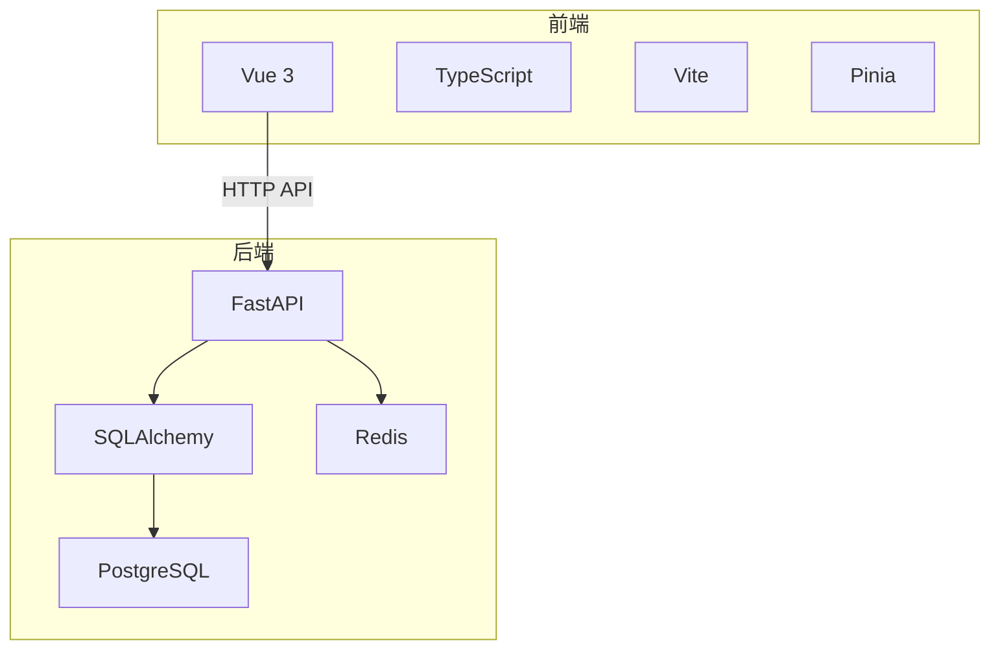
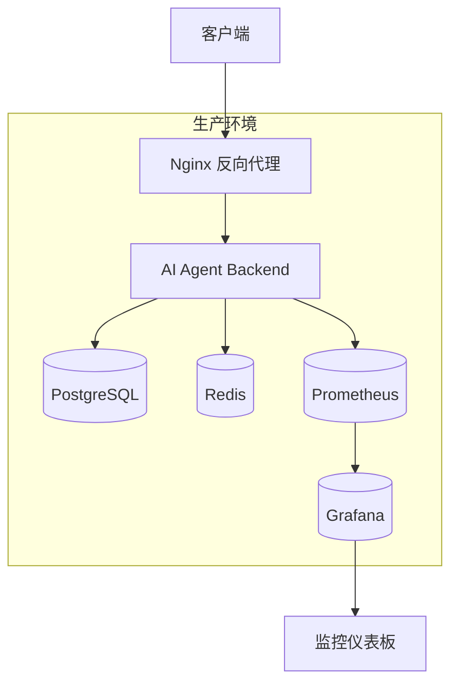
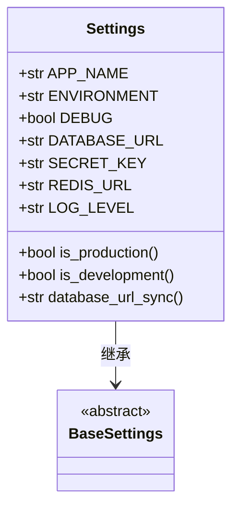
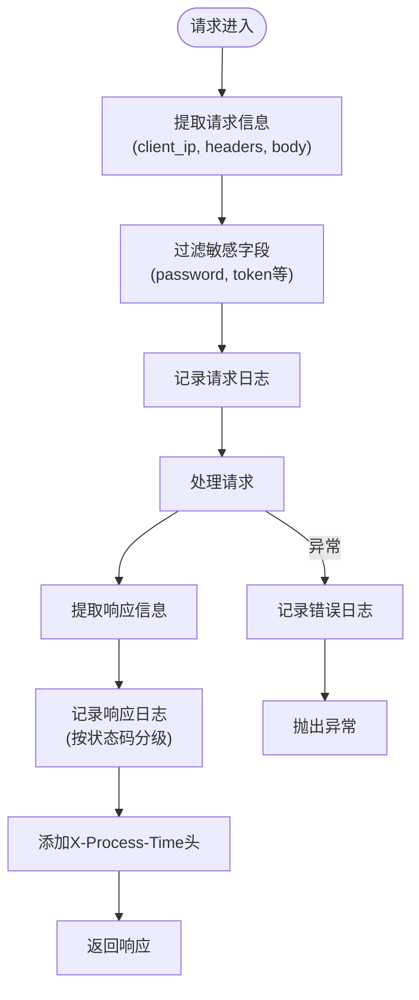
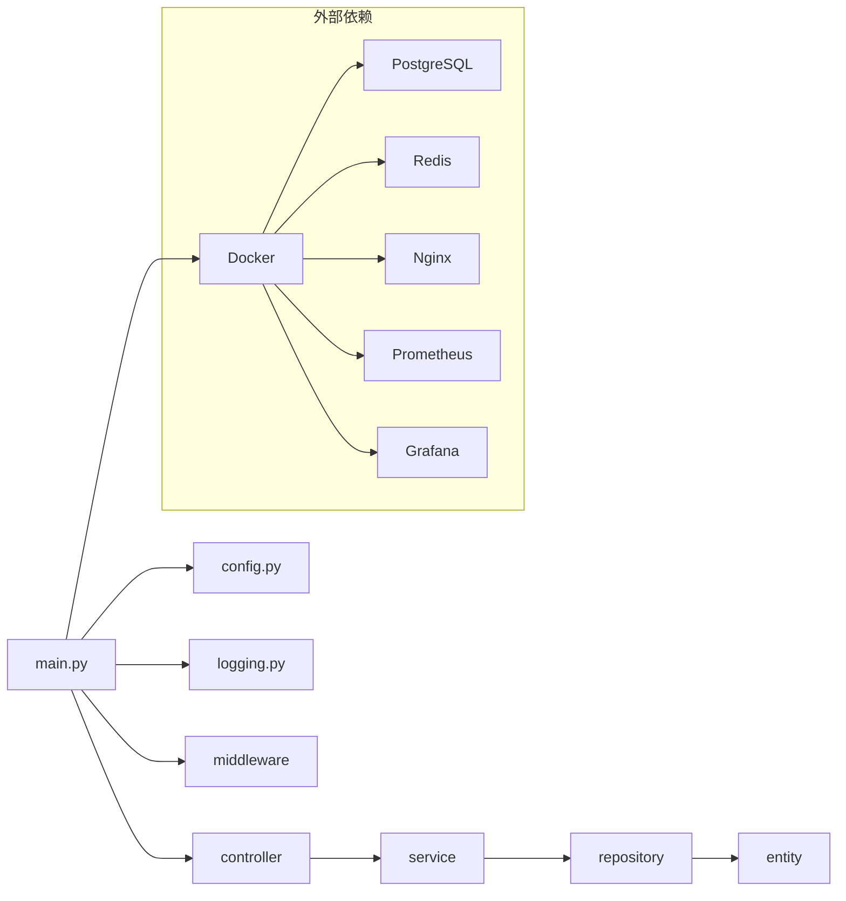

# 生产环境优化

<cite>
**本文档引用文件**  
- [main.py](file://AI-agent-backend/main.py)
- [config.py](file://AI-agent-backend/app/core/config.py)
- [logging.py](file://AI-agent-backend/app/middleware/logging.py)
- [Dockerfile](file://AI-agent-backend/Dockerfile)
- [docker-compose.yml](file://AI-agent-backend/docker-compose.yml)
</cite>

## 目录
1. [项目结构](#项目结构)  
2. [核心组件](#核心组件)  
3. [架构概览](#架构概览)  
4. [详细组件分析](#详细组件分析)  
5. [依赖分析](#依赖分析)  
6. [性能考虑](#性能考虑)  
7. [故障排除指南](#故障排除指南)  
8. [结论](#结论)

## 项目结构

项目采用分层架构设计，分为后端（AI-agent-backend）和前端（AI-agent-frontend）两个主要部分。后端基于FastAPI构建，采用企业级五层架构（Controller、Service、Repository、Entity、DTO），并使用Pydantic进行配置管理。前端使用Vue 3 + TypeScript构建，采用模块化组织方式。

关键目录说明：
- `AI-agent-backend/app/controller`：API控制器，处理HTTP请求路由
- `AI-agent-backend/app/service`：业务逻辑层
- `AI-agent-backend/app/repository`：数据访问层
- `AI-agent-backend/app/entity`：数据库实体模型
- `AI-agent-backend/app/dto`：数据传输对象
- `AI-agent-backend/app/middleware`：中间件实现（日志、CORS等）
- `AI-agent-backend/scripts`：数据库初始化与迁移脚本
- `AI-agent-backend/docs`：文档资源
- `AI-agent-frontend/src/views`：前端页面组件
- `AI-agent-frontend/src/api`：API接口定义



**图示来源**  
- [main.py](file://AI-agent-backend/main.py)
- [docker-compose.yml](file://AI-agent-backend/docker-compose.yml)

**本节来源**  
- [main.py](file://AI-agent-backend/main.py)
- [docker-compose.yml](file://AI-agent-backend/docker-compose.yml)

## 核心组件

系统核心组件包括：
- **FastAPI应用实例**：通过`main.py`创建，集成路由、中间件和异常处理
- **配置管理**：基于Pydantic Settings的`config.py`，支持环境变量和`.env`文件
- **日志中间件**：记录请求/响应日志，自动过滤敏感信息
- **健康检查端点**：`/health`提供服务状态监控
- **容器化部署**：Dockerfile和docker-compose.yml实现生产级部署

这些组件共同构成了一个可扩展、易维护的生产就绪系统。

**本节来源**  
- [main.py](file://AI-agent-backend/main.py#L1-L217)
- [config.py](file://AI-agent-backend/app/core/config.py#L1-L197)
- [logging.py](file://AI-agent-backend/app/middleware/logging.py#L1-L275)

## 架构概览

系统采用微服务风格的单体架构，通过Docker容器化部署多个服务组件。整体架构包含应用服务、数据库、缓存、反向代理和监控系统。



**图示来源**  
- [docker-compose.yml](file://AI-agent-backend/docker-compose.yml#L1-L144)

**本节来源**  
- [docker-compose.yml](file://AI-agent-backend/docker-compose.yml#L1-L144)

## 详细组件分析

### 配置管理分析

系统使用Pydantic Settings实现配置的外部化管理，确保敏感配置与代码分离，提升安全性和可维护性。

#### 配置类结构


**图示来源**  
- [config.py](file://AI-agent-backend/app/core/config.py#L1-L197)

#### 配置外部化机制
系统通过以下方式实现配置外部化：
1. **环境变量优先**：所有配置项均可通过环境变量覆盖
2. **.env文件支持**：自动加载`.env`文件中的配置
3. **生产环境验证**：对`SECRET_KEY`等敏感配置进行强度校验
4. **缓存单例**：使用`@lru_cache()`确保配置实例唯一

```python
class Settings(BaseSettings):
    SECRET_KEY: str = "dev-secret-key-change-this-in-production-environment"
    
    @validator("SECRET_KEY")
    def validate_secret_key(cls, v, values):
        if values.get("ENVIRONMENT") == "production":
            if len(v) < 32:
                raise ValueError("SECRET_KEY must be at least 32 characters in production")
            if v == "dev-secret-key-change-this-in-production-environment":
                raise ValueError("Must change default SECRET_KEY in production")
        return v

@lru_cache()
def get_settings() -> Settings:
    return Settings()

settings = get_settings()
```

**本节来源**  
- [config.py](file://AI-agent-backend/app/core/config.py#L1-L197)

### 日志与监控分析

系统实现了完善的日志收集和健康检查机制，支持集中式监控。

#### 日志中间件流程


**图示来源**  
- [logging.py](file://AI-agent-backend/app/middleware/logging.py#L1-L275)

#### 健康检查实现
系统提供两种健康检查机制：
1. **HTTP健康检查端点**：`/health`返回服务状态
2. **Docker健康检查**：容器内执行curl检测

```python
@app.get("/health", tags=["health"])
async def health_check():
    return {
        "status": "healthy",
        "service": settings.APP_NAME,
        "version": settings.APP_VERSION,
        "environment": settings.ENVIRONMENT,
        "timestamp": datetime.utcnow().isoformat()
    }
```

Docker健康检查配置：
```yaml
healthcheck:
  test: ["CMD", "curl", "-f", "http://localhost:8000/health"]
  interval: 30s
  timeout: 10s
  retries: 3
  start_period: 40s
```

**本节来源**  
- [main.py](file://AI-agent-backend/main.py#L121-L170)
- [logging.py](file://AI-agent-backend/app/middleware/logging.py#L1-L275)
- [docker-compose.yml](file://AI-agent-backend/docker-compose.yml#L1-L144)

### 部署架构分析

系统采用现代化的容器化部署架构，支持生产级运行。

#### Nginx反向代理配置
虽然Nginx配置文件未在仓库中，但`docker-compose.yml`显示了其集成：
```yaml
nginx:
  image: nginx:alpine
  ports:
    - "80:80"
    - "443:443"
  volumes:
    - ./nginx/nginx.conf:/etc/nginx/nginx.conf
    - ./nginx/ssl:/etc/nginx/ssl
  depends_on:
    - app
```

典型Nginx配置应包含：
- 静态资源服务
- Gzip压缩
- SSL/TLS终止（Let's Encrypt证书）
- 请求缓冲和超时设置
- 安全头配置

#### Gunicorn+Uvicorn生产配置
尽管Dockerfile使用uvicorn直接运行，生产环境建议使用Gunicorn管理Uvicorn工作进程：

```bash
# 推荐的生产启动命令
gunicorn -k uvicorn.workers.UvicornWorker -w 4 -b 0.0.0.0:8000 main:app
```

推荐的Gunicorn配置：
```python
# gunicorn_config.py
bind = "0.0.0.0:8000"
workers = 4
worker_class = "uvicorn.workers.UvicornWorker"
worker_connections = 1000
max_requests = 1000
max_requests_jitter = 100
timeout = 30
keepalive = 5
preload_app = True
```

#### SSL/TLS集成（Let's Encrypt）
建议使用Certbot自动管理Let's Encrypt证书：

```bash
# 生成证书
certbot certonly --nginx -d your-domain.com

# Nginx SSL配置示例
server {
    listen 443 ssl;
    server_name your-domain.com;
    
    ssl_certificate /etc/letsencrypt/live/your-domain.com/fullchain.pem;
    ssl_certificate_key /etc/letsencrypt/live/your-domain.com/privkey.pem;
    
    location / {
        proxy_pass http://app:8000;
        proxy_set_header Host $host;
        proxy_set_header X-Real-IP $remote_addr;
    }
}
```

#### 资源限制与监控
系统已集成Prometheus和Grafana监控：

```yaml
prometheus:
  image: prom/prometheus:latest
  ports:
    - "9090:9090"
  volumes:
    - ./monitoring/prometheus.yml:/etc/prometheus/prometheus.yml

grafana:
  image: grafana/grafana:latest
  ports:
    - "3000:3000"
  environment:
    - GF_SECURITY_ADMIN_PASSWORD=admin
```

**本节来源**  
- [Dockerfile](file://AI-agent-backend/Dockerfile#L1-L65)
- [docker-compose.yml](file://AI-agent-backend/docker-compose.yml#L1-L144)

## 依赖分析

系统依赖关系清晰，采用分层架构减少耦合。



**图示来源**  
- [main.py](file://AI-agent-backend/main.py)
- [docker-compose.yml](file://AI-agent-backend/docker-compose.yml)

**本节来源**  
- [main.py](file://AI-agent-backend/main.py)
- [docker-compose.yml](file://AI-agent-backend/docker-compose.yml)

## 性能考虑

### 进程管理建议
生产环境应使用Gunicorn管理多个Uvicorn工作进程：

```bash
# 启动命令
gunicorn -k uvicorn.workers.UvicornWorker -w ${WORKERS:-4} main:app

# 环境变量配置
export WORKERS=4  # 建议设置为CPU核心数
export WORKER_TIMEOUT=30
export MAX_REQUESTS=1000
export MAX_REQUESTS_JITTER=100
```

### 资源限制
通过Docker设置资源限制：

```yaml
app:
  image: ai-agent-backend
  deploy:
    resources:
      limits:
        cpus: '2.0'
        memory: 2G
      reservations:
        cpus: '0.5'
        memory: 512M
```

### 监控指标
系统已暴露以下监控指标：
- `/health`：健康检查
- Prometheus监控端口：9090
- 处理时间：`X-Process-Time`响应头
- 日志级别：DEBUG/INFO/WARNING/ERROR

## 故障排除指南

### 常见问题
1. **健康检查失败**
   - 检查应用是否正常启动
   - 验证`/health`端点可访问
   - 检查Docker健康检查配置

2. **数据库连接问题**
   - 验证`DATABASE_URL`环境变量
   - 检查PostgreSQL容器状态
   - 确认网络配置正确

3. **Redis连接失败**
   - 验证`REDIS_URL`配置
   - 检查Redis容器密码
   - 确认网络连通性

4. **Nginx 502错误**
   - 检查后端服务是否运行
   - 验证容器网络配置
   - 检查Nginx错误日志

### 日志分析
系统日志包含丰富信息：
- 请求日志：方法、路径、客户端IP、处理时间
- 响应日志：状态码、内容长度
- 错误日志：异常详情、堆栈信息
- 敏感信息已自动过滤

## 结论

本系统已具备生产环境部署的基础条件，通过Docker容器化、配置外部化、日志监控等机制确保了可维护性和可靠性。建议实施以下优化：
1. **部署Nginx反向代理**：实现SSL终止、静态资源服务和负载均衡
2. **使用Gunicorn进程管理**：提高并发处理能力
3. **配置Let's Encrypt证书**：实现HTTPS安全通信
4. **完善监控告警**：基于Prometheus和Grafana建立完整的监控体系
5. **加强安全配置**：生产环境禁用调试模式，强化密钥管理

通过以上优化，系统将具备高可用、高性能、高安全的生产级特性。