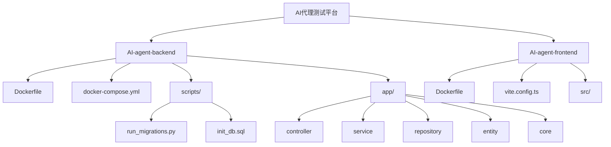
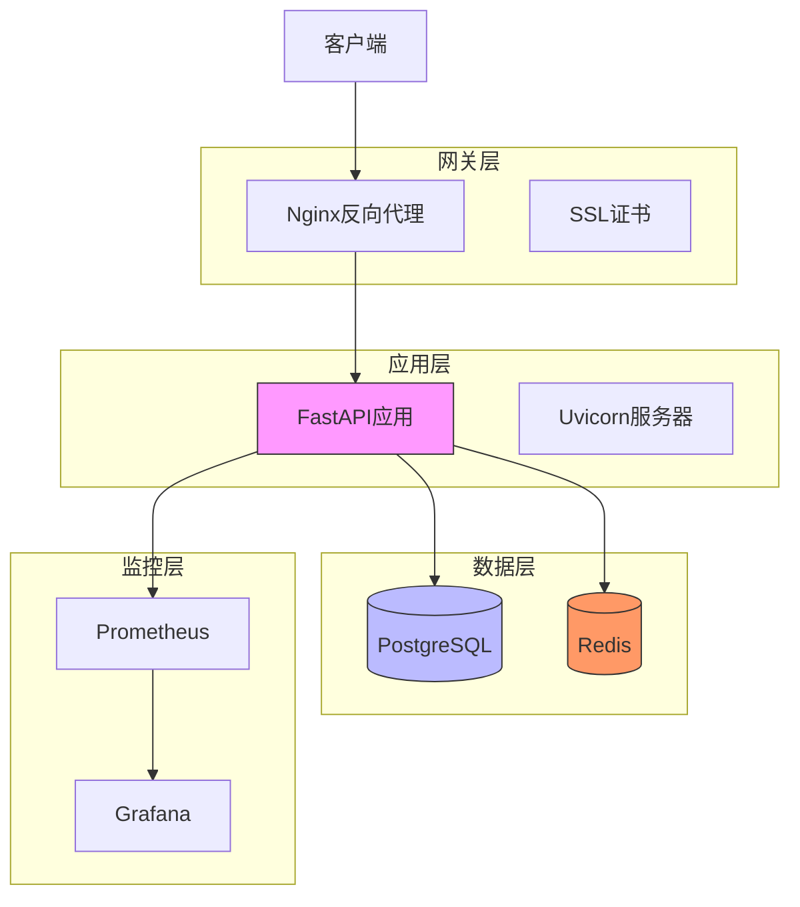
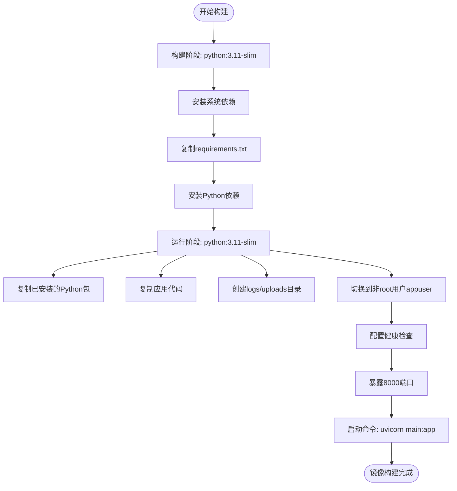
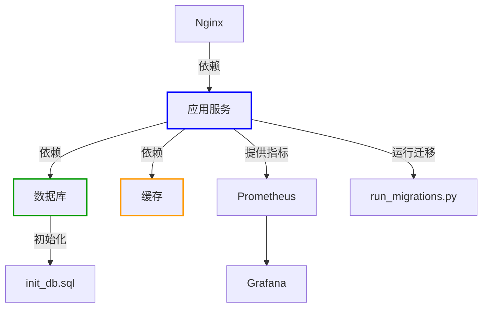
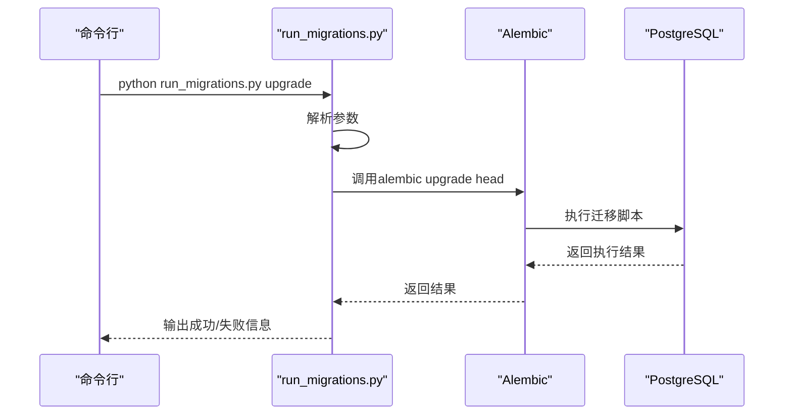
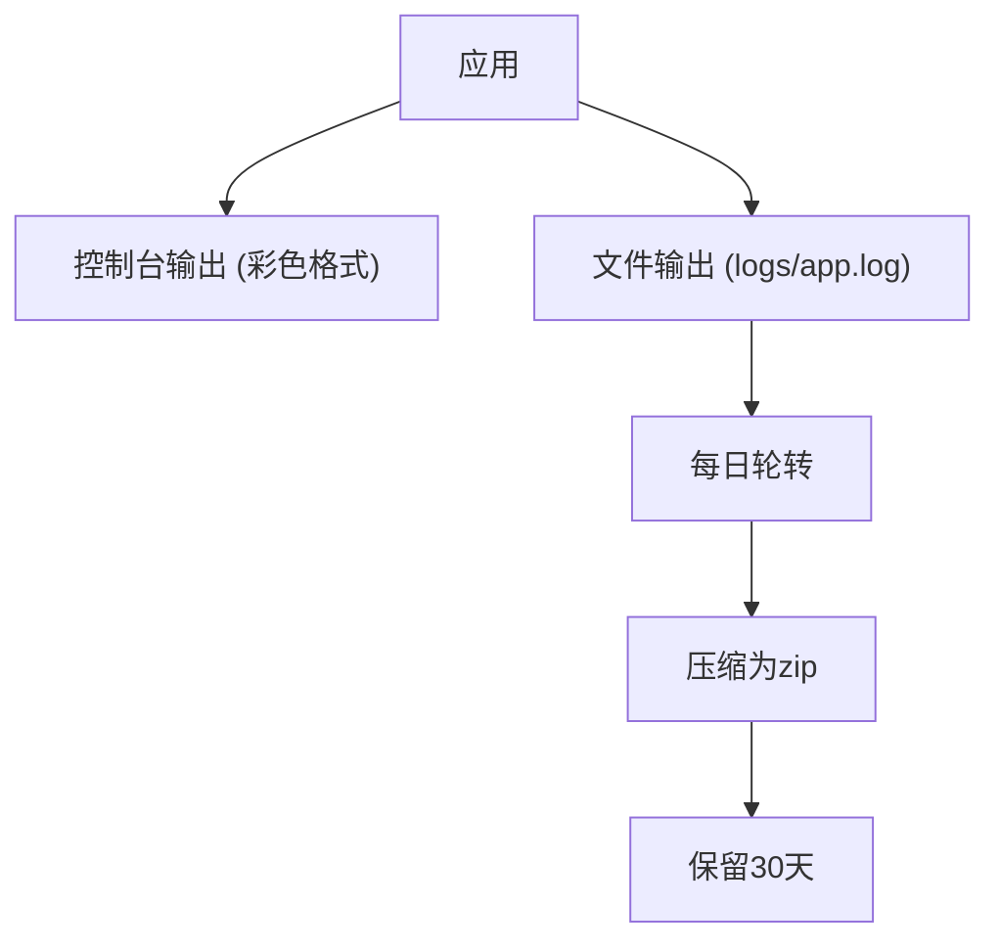
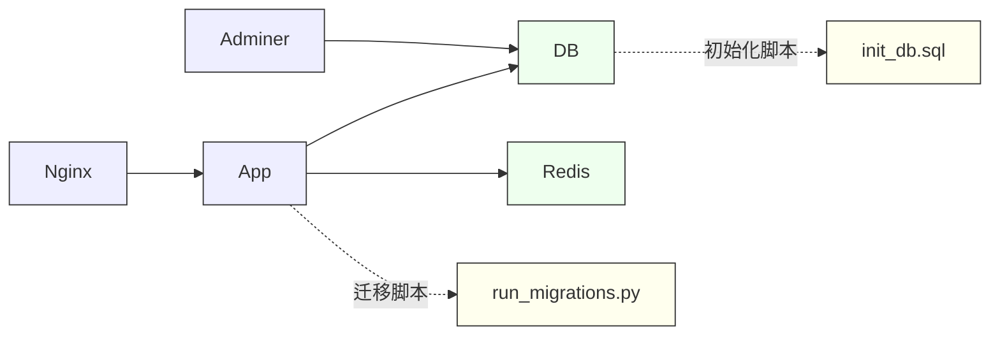

# 部署指南

<cite>
**本文档引用的文件**  
- [Dockerfile](file://AI-agent-backend/Dockerfile)
- [docker-compose.yml](file://AI-agent-backend/docker-compose.yml)
- [docker-compose.dev.yml](file://AI-agent-backend/docker-compose.dev.yml)
- [run_migrations.py](file://AI-agent-backend/scripts/run_migrations.py)
- [init_db.sql](file://AI-agent-backend/scripts/init_db.sql)
- [nginx.conf](file://AI-agent-backend/nginx/nginx.conf)
- [app/core/config.py](file://AI-agent-backend/app/core/config.py)
- [main.py](file://AI-agent-backend/main.py)
</cite>

## 目录

1. [简介](#简介)
2. [项目结构](#项目结构)
3. [核心组件](#核心组件)
4. [架构概览](#架构概览)
5. [详细组件分析](#详细组件分析)
6. [依赖分析](#依赖分析)
7. [性能考虑](#性能考虑)
8. [故障排除指南](#故障排除指南)
9. [结论](#结论)

## 简介

本部署指南详细说明了AI代理测试平台从代码构建到服务上线的完整流程。文档涵盖前后端Docker镜像构建、基于docker-compose的服务栈启动、数据库迁移自动化执行、生产环境最佳实践等内容。通过本指南，用户可快速搭建开发和生产环境，确保系统稳定运行。

## 项目结构

项目采用前后端分离架构，包含后端服务（AI-agent-backend）和前端应用（AI-agent-frontend）两个主要模块。后端基于FastAPI框架，前端使用Vue3技术栈。



**图示来源**  
- [Dockerfile](file://AI-agent-backend/Dockerfile)
- [docker-compose.yml](file://AI-agent-backend/docker-compose.yml)
- [scripts/run_migrations.py](file://AI-agent-backend/scripts/run_migrations.py)

**本节来源**  
- [AI-agent-backend](file://AI-agent-backend)
- [AI-agent-frontend](file://AI-agent-frontend)

## 核心组件

系统核心组件包括后端API服务、PostgreSQL数据库、Redis缓存、Nginx反向代理及监控组件。通过Docker容器化部署，各组件解耦且易于维护。

**本节来源**  
- [docker-compose.yml](file://AI-agent-backend/docker-compose.yml)
- [Dockerfile](file://AI-agent-backend/Dockerfile)

## 架构概览

系统采用微服务架构，通过Docker Compose编排多个服务，形成完整的技术栈。架构包含应用层、数据层、缓存层、网关层和监控层。



**图示来源**  
- [docker-compose.yml](file://AI-agent-backend/docker-compose.yml)
- [Dockerfile](file://AI-agent-backend/Dockerfile)

## 详细组件分析

### 后端镜像构建分析

后端使用多阶段Docker构建策略，优化镜像大小并提升安全性。



**图示来源**  
- [Dockerfile](file://AI-agent-backend/Dockerfile#L1-L65)

**本节来源**  
- [Dockerfile](file://AI-agent-backend/Dockerfile#L1-L65)

### 服务栈编排分析

通过docker-compose.yml文件定义完整的服务栈，确保各服务按正确顺序启动。



**图示来源**  
- [docker-compose.yml](file://AI-agent-backend/docker-compose.yml#L1-L143)

**本节来源**  
- [docker-compose.yml](file://AI-agent-backend/docker-compose.yml#L1-L143)

### 数据库迁移流程分析

数据库迁移通过Alembic工具管理，确保模式变更可追溯且可重复。



**图示来源**  
- [run_migrations.py](file://AI-agent-backend/scripts/run_migrations.py#L1-L237)

**本节来源**  
- [run_migrations.py](file://AI-agent-backend/scripts/run_migrations.py#L1-L237)

### 生产环境部署最佳实践

#### 反向代理与SSL配置

尽管Nginx配置文件存在路径引用，但实际文件未在仓库中找到。建议创建`nginx/nginx.conf`文件，配置如下：

```nginx
server {
    listen 80;
    listen 443 ssl;
    server_name your-domain.com;
    
    ssl_certificate /etc/nginx/ssl/cert.pem;
    ssl_certificate_key /etc/nginx/ssl/key.pem;
    
    location / {
        proxy_pass http://app:8000;
        proxy_set_header Host $host;
        proxy_set_header X-Real-IP $remote_addr;
        proxy_set_header X-Forwarded-For $proxy_add_x_forwarded_for;
        proxy_set_header X-Forwarded-Proto $scheme;
    }
    
    location /api/v1 {
        proxy_pass http://app:8000;
        proxy_set_header Host $host;
    }
}
```

#### 日志收集方案

系统使用loguru进行日志管理，配置文件位于`app/core/logger.py`。日志自动轮转并压缩，保留30天。



**本节来源**  
- [docker-compose.yml](file://AI-agent-backend/docker-compose.yml#L85)
- [app/core/logger.py](file://AI-agent-backend/app/core/logger.py)

#### 健康检查设置

所有关键服务均配置健康检查，确保容器编排系统能正确管理服务状态。

| 服务 | 健康检查命令 | 间隔 | 超时 | 重试 | 启动等待 |
|------|-------------|------|------|------|----------|
| 应用 | curl -f http://localhost:8000/health | 30s | 10s | 3 | 40s |
| 数据库 | pg_isready -U postgres | 10s | 5s | 5 | - |
| Redis | redis-cli --raw incr ping | 10s | 3s | 5 | - |

**本节来源**  
- [docker-compose.yml](file://AI-agent-backend/docker-compose.yml#L50-L55)

## 依赖分析

系统各组件间存在明确的依赖关系，确保服务按正确顺序启动。



**图示来源**  
- [docker-compose.yml](file://AI-agent-backend/docker-compose.yml)
- [scripts/init_db.sql](file://AI-agent-backend/scripts/init_db.sql)

**本节来源**  
- [docker-compose.yml](file://AI-agent-backend/docker-compose.yml)
- [scripts/init_db.sql](file://AI-agent-backend/scripts/init_db.sql)

## 性能考虑

生产环境部署时需考虑以下性能优化措施：

1. **数据库连接池**：配置合适的连接池大小，避免连接耗尽
2. **Redis缓存**：合理设置缓存TTL，减少数据库压力
3. **Gunicorn+Uvicorn**：生产环境建议使用Gunicorn管理多个Uvicorn工作进程
4. **静态文件服务**：由Nginx直接服务前端静态文件，减轻应用服务器负担
5. **监控告警**：通过Prometheus+Grafana监控系统指标，及时发现性能瓶颈

## 故障排除指南

### 常见问题及解决方案

1. **数据库连接失败**
   - 检查`DATABASE_URL`环境变量配置
   - 确认数据库容器已正常启动
   - 验证网络配置是否正确

2. **迁移执行失败**
   - 检查`alembic.ini`配置文件
   - 确认数据库连接信息正确
   - 查看日志文件`logs/app.log`获取详细错误信息

3. **Nginx 502错误**
   - 确认应用服务已正常启动
   - 检查容器间网络通信
   - 验证反向代理配置中的服务名称和端口

4. **健康检查失败**
   - 检查`/health`端点是否正常响应
   - 验证端口映射配置
   - 确认防火墙设置未阻止通信

**本节来源**  
- [docker-compose.yml](file://AI-agent-backend/docker-compose.yml)
- [main.py](file://AI-agent-backend/main.py)
- [app/core/health.py](file://AI-agent-backend/app/core/health.py)

## 结论

本部署指南提供了AI代理测试平台从开发到生产的完整部署方案。通过Docker容器化技术，实现了环境一致性、部署便捷性和系统可维护性。建议生产环境采用本指南推荐的最佳实践，确保系统稳定、安全、高效运行。