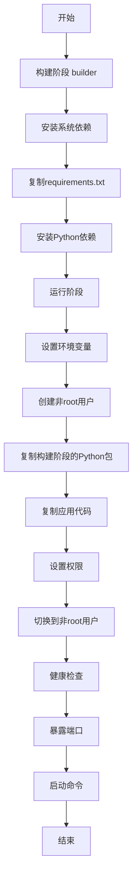
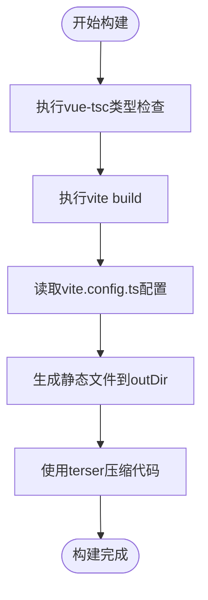
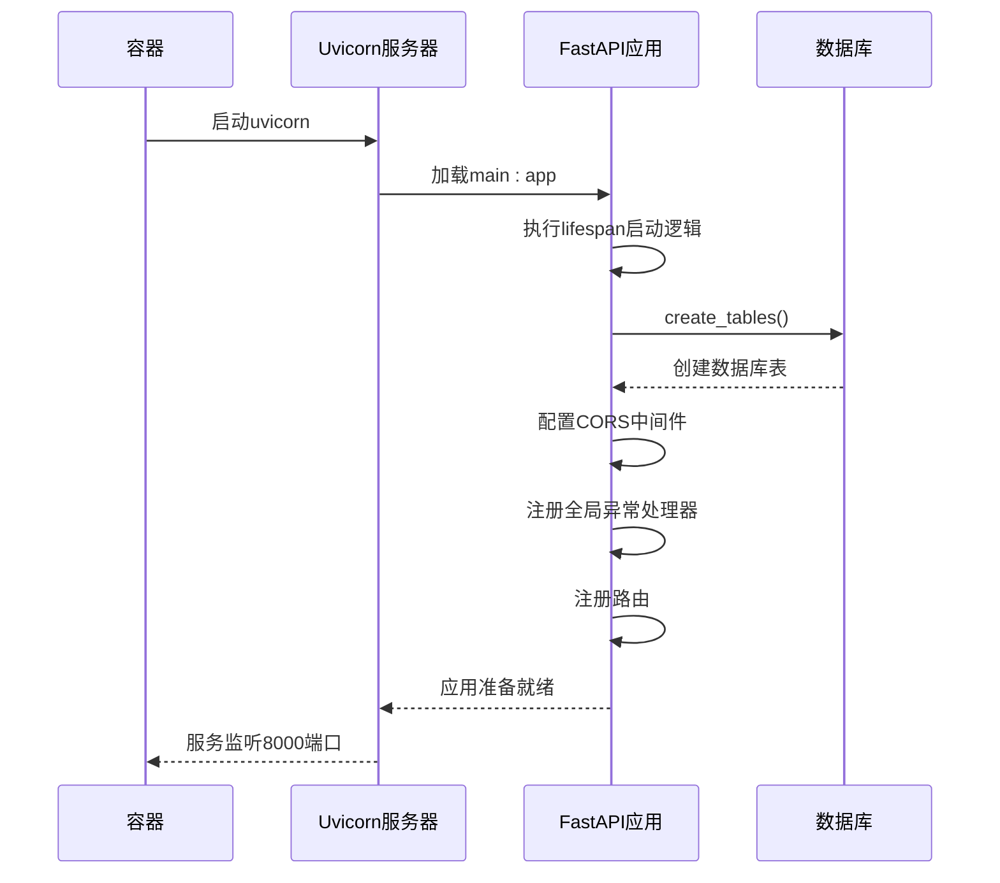

# 镜像构建

<cite>
**本文档引用的文件**   
- [Dockerfile](file://AI-agent-backend/Dockerfile)
- [main.py](file://AI-agent-backend/main.py)
- [vite.config.ts](file://AI-agent-frontend/vite.config.ts)
- [package.json](file://AI-agent-frontend/package.json)
- [docker-compose.yml](file://AI-agent-backend/docker-compose.yml)
</cite>

## 目录
1. [后端FastAPI服务镜像构建](#后端fastapi服务镜像构建)
2. [前端Vue应用镜像构建与部署](#前端vue应用镜像构建与部署)
3. [容器启动流程分析](#容器启动流程分析)
4. [构建命令与版本管理](#构建命令与版本管理)

## 后端FastAPI服务镜像构建

本节详细说明如何基于Dockerfile构建后端FastAPI服务的Docker镜像，包括多阶段构建策略、依赖安装、环境变量注入和生产镜像打包过程。

### 多阶段构建策略

后端Dockerfile采用多阶段构建（multi-stage build）策略，将构建过程分为`builder`（构建阶段）和运行阶段，有效优化最终镜像大小。



**Diagram sources**
- [Dockerfile](file://AI-agent-backend/Dockerfile#L1-L65)

**Section sources**
- [Dockerfile](file://AI-agent-backend/Dockerfile#L1-L65)

### 依赖安装与环境配置

在构建阶段，Dockerfile首先安装编译所需的系统依赖（如`build-essential`），然后复制`requirements.txt`文件并使用pip安装所有Python依赖。此阶段使用`--no-cache-dir`选项避免缓存，减小中间镜像体积。

在运行阶段，仅安装运行时所需的轻量级依赖（如`curl`），并通过`COPY --from=builder`指令从构建阶段复制已安装的Python包，避免在最终镜像中包含编译工具链。

环境变量通过`ENV`指令注入，包括：
- `PYTHONUNBUFFERED=1`: 确保Python输出立即刷新
- `PYTHONDONTWRITEBYTECODE=1`: 防止写入`.pyc`文件
- `PIP_NO_CACHE_DIR=1`: 禁用pip缓存
- `PIP_DISABLE_PIP_VERSION_CHECK=1`: 禁用pip版本检查

**Section sources**
- [Dockerfile](file://AI-agent-backend/Dockerfile#L25-L45)

### 生产镜像打包

最终镜像以非root用户`appuser`运行，提高安全性。通过`mkdir -p logs uploads`创建日志和上传目录，并使用`chown`确保权限正确。镜像暴露8000端口，并配置健康检查（HEALTHCHECK）以确保服务正常运行。

## 前端Vue应用镜像构建与部署

尽管项目中未直接提供前端Dockerfile，但通过分析`vite.config.ts`、`package.json`和`docker-compose.yml`，可以推断其构建和部署流程。

### 静态资源编译

前端项目使用Vite作为构建工具。`package.json`中的构建脚本定义了不同环境的构建命令：
- `build`: 执行`vue-tsc -b && vite build`，进行类型检查并构建生产版本
- `build:dev`: 使用开发模式构建
- `build:prod`: 使用生产模式构建

`vite.config.ts`配置了构建输出目录：
- 当`VITE_ENV=production`时，输出到`AI-agent-frontend`目录
- 其他情况输出到`AI-agent-frontend-test`目录

构建过程启用`terser`进行代码压缩，并配置`drop_debugger`移除调试器语句。



**Diagram sources**
- [vite.config.ts](file://AI-agent-frontend/vite.config.ts#L45-L55)
- [package.json](file://AI-agent-frontend/package.json#L7-L12)

**Section sources**
- [vite.config.ts](file://AI-agent-frontend/vite.config.ts#L45-L55)
- [package.json](file://AI-agent-frontend/package.json#L7-L12)

### 部署方式推断

`docker-compose.yml`文件中定义了`nginx`服务，其配置文件挂载路径为`./nginx/nginx.conf`。结合前端构建的静态文件特性，可以推断部署流程为：
1. 在CI/CD流程中，执行`npm run build:prod`生成生产环境静态文件
2. 将构建产物（`AI-agent-frontend`目录）复制到Nginx容器的HTML根目录
3. 通过Nginx服务静态文件，并反向代理API请求到后端服务

Nginx配置将`/api`路径的请求代理到后端`app`服务，实现前后端分离部署。

**Section sources**
- [docker-compose.yml](file://AI-agent-backend/docker-compose.yml#L90-L101)
- [vite.config.ts](file://AI-agent-frontend/vite.config.ts#L35-L40)

## 容器启动流程分析

本节结合`main.py`入口文件说明后端容器的启动流程。

### FastAPI应用初始化

`main.py`文件是FastAPI应用的主入口。当容器启动时，执行`CMD ["uvicorn", "main:app", "--host", "0.0.0.0", "--port", "8000"]`命令，通过uvicorn服务器启动应用。



**Diagram sources**
- [main.py](file://AI-agent-backend/main.py#L1-L216)
- [Dockerfile](file://AI-agent-backend/Dockerfile#L64-L65)

**Section sources**
- [main.py](file://AI-agent-backend/main.py#L1-L216)

### 应用生命周期管理

应用通过`@asynccontextmanager`装饰的`lifespan`函数管理生命周期。启动时：
1. 记录启动日志
2. 调用`create_tables()`创建数据库表
3. 记录启动成功日志

关闭时记录关闭日志。此机制确保了数据库的自动初始化。

### 路由与中间件

应用注册了多个路由（角色、菜单、部门、用户），并配置了CORS中间件以支持跨域请求。自定义中间件处理CORS预检请求和请求日志记录。

## 构建命令与版本管理

### 构建命令示例

**后端镜像构建：**
```bash
# 构建开发镜像
docker build -t ai-agent-backend:dev -f AI-agent-backend/Dockerfile .

# 构建生产镜像
docker build -t ai-agent-backend:1.0.0 -f AI-agent-backend/Dockerfile .

# 使用docker-compose构建
docker-compose -f AI-agent-backend/docker-compose.yml build
```

**前端镜像构建（推断）：**
```bash
# 构建静态文件
cd AI-agent-frontend
npm run build:prod

# 构建Nginx镜像（需自定义Dockerfile）
docker build -t ai-agent-frontend:1.0.0 -f nginx/Dockerfile .
```

### 镜像标签管理

建议采用语义化版本控制和环境标签：
- `ai-agent-backend:dev` - 开发镜像
- `ai-agent-backend:test` - 测试镜像
- `ai-agent-backend:1.0.0` - 生产版本
- `ai-agent-backend:latest` - 最新稳定版

通过`docker-compose.yml`中的`build`配置，可以实现服务的自动化构建和部署。

**Section sources**
- [Dockerfile](file://AI-agent-backend/Dockerfile)
- [docker-compose.yml](file://AI-agent-backend/docker-compose.yml)