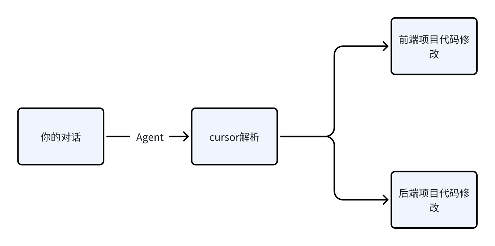

# Copyright (c) 2025 左岚. All rights reserved.

# Cursor 前后端分离项目开发指南

## 目录
- [项目概述](#项目概述)
- [前后端开发的两种模式](#前后端开发的两种模式)
  - [模式一：统一文件夹管理](#模式一统一文件夹管理)
  - [模式二：分离文件夹管理](#模式二分离文件夹管理)
- [项目初始化](#项目初始化)
- [前后端协作流程](#前后端协作流程)
- [文档阶段](#文档阶段)
- [拆分前后端任务](#拆分前后端任务)
- [启动前后端测试](#启动前后端测试)

## 项目概述

本期视频主题：**零代码使用 Cursor 完成一个前后端分离的小项目**

### 技术栈
- **前端**: Vue3
- **后端**: Java SpringBoot

## 前后端开发的两种模式

### 模式一：统一文件夹管理

将前端项目、后端项目放到同一个文件夹中，然后用 Cursor 打开这个文件夹。

```
project-name/
├── front-end/
└── back-end/
```

#### 优点
- 一次 agent 对话能同时修改前端和后端项目
- 适合小型项目，或者你自己能很好地管理上下文，能及时切换新的对话




#### 缺点
1. 项目规模大了不好管理 rules 文件
2. 很容易挤爆上下文，经常要"新开对话"

### 模式二：分离文件夹管理

将前端项目、后端项目放到不同文件夹中，然后用不同的 Cursor 打开对应的项目。

- **Front-end** 项目独立管理
- **Back-end** 项目独立管理


## 项目初始化

前后端项目采用 **Vue3 + SpringBoot** 的方式

### 前端初始化
- 将 Vue3 的框架 rules 放到前端项目中
- Vue3 框架 rules 配置

### 后端初始化
- Spring Boot 可以从 [https://start.spring.io/](https://start.spring.io/) 下载安装包
- 同时也把 rules 文件放到项目中

#### 初始化命令示例

**前端项目初始化：**
```prompt
在当前目录下，根据 @vue3.mdc 初始化一个前端项目，使用 pnpm 来管理包结构，需要支持本地 API 测试环境联调
```

**后端项目初始化：**  
```prompt
根据 @springboot.mdc 完善项目结构信息，添加 mybatis-plus
```

## 前后端协作流程


## 文档阶段
### 项目需求示例

```prompt
我现在需要做一个移动端H5商城，产品的功能只有这几个：

1. 用户查看商品列表页面
2. 用户点击加减号进行购物车操作  
3. 用户浏览购物车

根据以上内容，帮我完成一个产品需求文档，需要包含页面设计、UI元素，技术栈，不要包含任何代码
```

### 原型部分

了解老板的核心需求，把核心需求列成功能点，通过功能点生成原型界面，目的是在最快的时间内能出来一个东西，方便进行下一次沟通。

- 先出全部页面，再局部调整

### 配合UI提示词

```prompt
你是一个专业的UI设计师，你需要根据我提供的需求文档来完成页面的设计

请仔细阅读 需求文档 @supplier.md， 现在需要输出高保真的原型图，请通过以下方式帮我完成所有界面的原型设计，并确保这些原型界面可以直接用于开发：

1、用户体验分析：先分析这个 App 的主要功能和用户需求，确定核心交互逻辑。

2、产品界面规划：作为产品经理，定义关键界面，确保信息架构合理。

3、高保真 UI 设计：作为 UI 设计师，设计贴近真实 iOS/Android 设计规范的界面，使用现代化的 UI 元素，使其具有良好的视觉体验。

4、HTML 原型实现：使用 HTML + Tailwind CSS（或 Bootstrap）生成所有原型界面，并使用 FontAwesome（或其他开源 UI 组件）让界面更加精美、接近真实的 App 设计。拆分代码文件，保持结构清晰：

5、每个界面应作为独立的 HTML 文件存放，例如 home.html、profile.html、settings.html 等。

• index.html 作为主入口，不直接写入所有界面的 HTML 代码，而是使用 iframe 的方式嵌入这些 HTML 片段，并将所有页面直接平铺展示在 index 页面中，而不是跳转链接。

• 真实感增强：  - 界面尺寸应模拟 iPhone 15 Pro，并让界面圆角化，使其更像真实的手机界面。 

• 使用真实的 UI 图片，而非占位符图片（可从 Unsplash、Pexels、Apple 官方 UI 资源中选择）。 

• 添加顶部状态栏（模拟 iOS 状态栏），并包含 App 导航栏（类似 iOS 底部 Tab Bar）。

请按照以上要求生成完整的 HTML 代码，并确保其可用于实际开发
```

使用 claude-4-sonnet thinking 模式，出的效果非常好，后面就是对整体页面进行局部调整。

用这个版本生成各个端的原型页面，跟老板确认需求，为下一步正式页面开发做好准备。
## 拆分前后端任务


> **注意**: 跟 Cursor 对话一定是任务越小越细，返回的代码质量就会越高，反之，Cursor 大概率会返回有问题的代码。

拆分任务的好处是我们能知道 Cursor 会以什么样的方式来完成。

### 前端开发

```prompt
你是具有丰富开发经验的前端开发工程师，请你阅读@xuqu.md这个产品及UI文档，你需要完成这个产品的前端页面开发，这是一个移动端的H5页面，需要适配手机访问，请你按照你丰富的前端开发经验，拆解出详细的前端开发任务，按照以下格式保存到doc目录中。

- 根据开发顺序创建TASK001这样的任务编号；
- 每个任务包含名称，任务描述，版本，状态（计划中、测试单元编写中、开发中、完成等）。
每个TASK都有验收标准清单和注意事项（提醒用户或将来的AI助手需要注意的详细内容）
```

### 启动测试

```bash
yarn install
yarn dev
```

### 接口统一

```prompt
@mock @api @CartView.vue @ProductListView.vue 所有的模拟接口必须写到 api 中，方便后面替换成真实的接口，使用 mock 变量来控制是否开启 mock 数据，api 下接口的规范如下

/**
 * 接口名称
 * 功能描述
 * 入参
 * 返回参数
 * url地址
 * 请求方式
 **/
```

使用 rules 来约束接口的规范。

### 安装 Stagewise

在插件市场中，搜索 `stagewise`，进行安装
- GitHub: [https://github.com/stagewise-io/stagewise](https://github.com/stagewise-io/stagewise)

安装完成后，使用快捷键：`CMD + Shift + P` 打开命令面板，搜索 `stagewise`，按下 Enter 键即可。

### 后端开发

#### 生成前端已经对接的 API 文档

> 这一步如果事先有 API 文档可以不用管


```prompt
@api 根据当前文件下所有的 API 文件生成接口文档，放到 doc 目录中，遵循以下格式：

• 接口名称
• 功能描述: 详细描述接口的功能和用途
• 入参: 参数类型和说明
  - param1: type - 参数1说明
  - param2: type - 参数2说明
• 返回参数: 返回值类型和说明
  - field1: type - 字段1说明
  - field2: type - 字段2说明
• url地址: /api/endpoint
• 请求方式: GET/POST/PUT/DELETE
```

会生成对应的接口文档，将接口文档和需求文档拷贝到后端项目中，开始拆分后端的开发任务。

对于后端来说，数据库的设计非常重要，如果你会的话，可以自己设计，然后形成文档。

#### 拆分后端任务

```prompt
你是具有丰富开发经验的后端开发工程师，请阅读以下的需求和 API 文档，你需要完成这个产品的后端开发，请你按照你丰富的后端开发经验，拆解出详细的后端开发任务，按照以下格式保存到 doc 目录中的任务 md 文件中。

格式如下：
• 根据开发顺序创建TASK001这样的任务编号；
• 每个任务包含名称，任务描述，版本，状态（计划中、测试单元编写中、开发中、完成等）。
每个TASK都有验收标准清单和注意事项（提醒用户或将来的AI助手需要注意的详细内容）
任务描述中不需要返回任何代码示例
```

```prompt
@后端开发任务.md 现在你开始执行任务，每次只能执行一个任务，执行任务完成后需要更新任务状态以及验收清单。功能和接口规范需要跟 @doc 下文档保持一致。必须是我回复后才能继续下一项任务
```

## 启动前后端测试

告诉前端后端的服务 IP 地址，并更改 mock 为 false。
